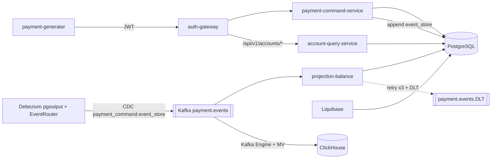

# PayPulse

Платформа обработки платежей: **event-sourced ledger** в PostgreSQL, **CDC** изменений `event_store` в Kafka через **Debezium Outbox EventRouter**, потребление в **ClickHouse** для аналитики и в **projection-balance** для read-side. Реализованы слайсы **S0 + S1**: приём платежа через **Spring Cloud Gateway** (JWT HS256) → **payment-command-service** (WebFlux + R2DBC) → запись в `event_store` → CDC → Kafka `payment.events` → проекция баланса и temporal API + ClickHouse-аналитика.

## Быстрый старт

Требования: Docker, JDK 21 (для локальной сборки), порты **8090**, **8086**, **8087**, **55432**, **19092**, **8124**, **18083**, **18088** свободны.

```bash
./gradlew build -x test
docker compose up --build -d
```

Если ранее запускали проект на старой версии схемы — сделайте чистый ресет, иначе у Postgres останется старый replication slot:

```bash
docker compose down -v
docker compose up --build -d
```

Проверка:

1. Логин: `POST http://localhost:8090/auth/login` с телом `{"username":"admin","password":"admin"}`.
2. Создать платёж: `POST http://localhost:8090/api/v1/payments` с заголовком `Authorization: Bearer <token>` (см. [docs/demo/payments.http](docs/demo/payments.http)).
3. Прямой вызов сервиса команд (без JWT, только для отладки): `POST http://localhost:8086/api/v1/payments`.
4. Проверка read-side через gateway: `GET http://localhost:8090/api/v1/accounts/<accountId>/balance?currency=USD`.
5. Temporal запрос: `GET http://localhost:8090/api/v1/accounts/<accountId>/balance?currency=USD&at=2099-01-01T00:00:00Z`.
6. Kafka UI: http://localhost:18088 — топики `payment.events` и `payment.events.DLT`.
7. ClickHouse:
   ```bash
   docker exec -it paypulse-clickhouse clickhouse-client \
     -q "SELECT count() FROM paypulse_analytics.payment_events_raw"
   ```

## Архитектура S0 + S1



Ключевые свойства, согласно плану §12.4:

- **`payment.events` — из CDC `event_store`** (event store — integration log). Debezium pgoutput захватывает INSERT, `EventRouter` SMT использует:
  - `account_id` колонку как Kafka-key (partition by account → строгий порядок событий одного аккаунта);
  - `payload` JSON разворачивается в value сообщения (`table.expand.json.payload=true`) → чистый JSON без CDC-обёртки;
  - заголовки сообщений: `id` (PK строки event_store), `eventType`, `eventVersion`, `aggregateId`.
- **`outbox` зарезервирован для S2+** (saga lifecycle, rule changes). В S0/S1 в outbox ничего не пишется; таблица, starter и autoconfig доступны для следующих этапов.
- **Идемпотентный POST** (`Idempotency-Key`): SHA-256 от ключа и тела запроса; при повторе с тем же ключом и совпадающим телом возвращается прежний `200`, при расхождении — `409`.
- **Идемпотентная проекция**: дедуп по `eventId` через `INSERT ... ON CONFLICT (source_event_id) DO NOTHING`; затем атомарный `UPSERT account_balance` с дельтой (`balance = balance + EXCLUDED.balance`) — никакого read-modify-write.
- **At-least-once с DLQ**: `enable-auto-commit=false`, `MANUAL_IMMEDIATE` ack, `DefaultErrorHandler` с retry x3 (interval 1s) и `DeadLetterPublishingRecoverer` в `payment.events.DLT`.
- **Temporal API**: `GET /api/v1/accounts/{id}/balance?at=...` возвращает баланс на момент времени по `account_query.balance_events`.

## Модули

| Модуль | Назначение | Стадия |
|--------|------------|--------|
| `shared/common-model` | DTO запросов/ответов | S0 |
| `shared/metrics-starter` | Общие теги Micrometer | S0 |
| `shared/outbox-publisher-starter` | INSERT+DELETE в outbox в существующей транзакции (MANDATORY); ждёт использования в S2 | подготовлено |
| `payment-command-service` | Hexagonal-style: REST → application → R2DBC event_store + idempotency | S0 |
| `projection-balance` | Kafka consumer `payment.events` → `account_query.account_balance`/`balance_events`, retry + DLT | S1 |
| `account-query-service` | `GET /api/v1/accounts/{id}/balance` + `?at=` (temporal) | S1 |
| `auth-gateway` | Spring Cloud Gateway + JWT (jjwt) + `/auth/login` | S0 |
| `payment-generator` | Периодические демо-платежи через gateway | S0 |

## Форма события `PaymentInitiatedV1`

`event_store.payload` (TEXT/JSON), он же — value Kafka-сообщения после `EventRouter` с `table.expand.json.payload=true`:

```json
{
  "eventId": "11111111-1111-1111-1111-111111111111",
  "paymentId": "22222222-2222-2222-2222-222222222222",
  "accountId": "acc-1",
  "amount": 99.50,
  "currency": "USD",
  "merchantId": "merchant-demo",
  "occurredAt": "2026-05-09T18:00:00Z"
}
```

Kafka headers (от EventRouter): `id` (PK строки `event_store`, `BIGINT`), `eventType` = `PaymentInitiatedV1`, `eventVersion` = `1`, `aggregateId` = `paymentId`. Kafka key = `accountId`.

## Переменные окружения (важные)

| Переменная | Описание |
|------------|----------|
| `PAYPULSE_JWT_SECRET` | Секрет HS256 (минимум 32 байта), одинаковый для выдачи и проверки токена в gateway |
| `PAYPULSE_PAYMENT_COMMAND_URI` | URI сервиса команд для gateway |
| `PAYPULSE_ACCOUNT_QUERY_URI` | URI сервиса query-side для gateway |
| `PAYPULSE_GATEWAY_URL` | Базовый URL gateway для генератора |
| `PAYPULSE_KAFKA_BOOTSTRAP` | Bootstrap-серверы Kafka для consumer/producer (DLT) |

## Соответствие плану

Реализация ведётся по [`docs/pay-pulse-platform-plan.md`](docs/pay-pulse-platform-plan.md) (11 этапов `S0`..`S10`; исполнимые чек-листы — [`docs/stages/README.md`](docs/stages/README.md)).

- **S0** — закрыт по архитектуре. Pending: один Superset chart (S7-задел) и Redpanda Console (используется `redpandadata/console`, что эквивалентно).
- **S1** — закрыт.
- `S2` (saga-orchestrator), `S3..S10` — не начаты.

## Лицензия

Учебный / портфолио проект.
