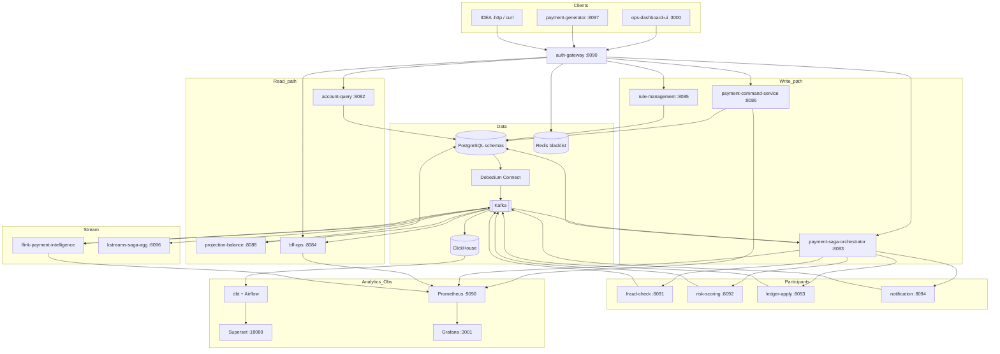
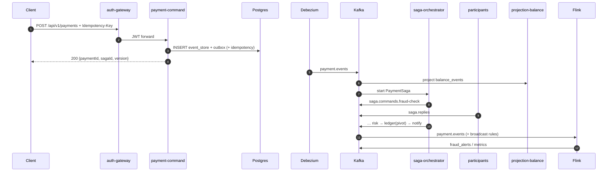
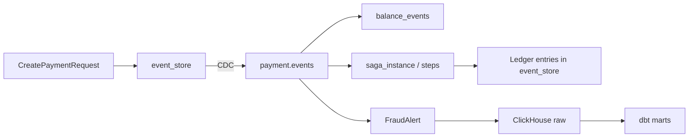

# PayPulse

**Real-Time Payment Intelligence Platform** — платформа приёма и проведения платежей с live-антифродом, аудитом и операционным контролем.

## Оглавление

1. [💼 Бизнес-идея](#-бизнес-идея)
2. [📌 Инженерные задачи](#-инженерные-задачи)
3. [🎯 Как это устроено](#-как-это-устроено)
4. [Архитектура (overview)](#архитектура-overview)
5. [✅ Ключевые возможности](#-ключевые-возможности)
6. [🛠 Технологический стек](#-технологический-стек)
7. [Архитектура по слоям](#архитектура-по-слоям)
8. [Модель данных и DDL](#модель-данных-и-ddl)
9. [🔧 REST API](#-rest-api)
10. [Kafka Topics](#kafka-topics)
11. [📊 Observability](#-observability)
12. [📈 Analytics (Superset + dbt)](#-analytics-superset--dbt)
13. [🎨 React Ops Dashboard](#-react-ops-dashboard)
14. [Требования](#требования)
15. [🚀 Быстрый старт](#-быстрый-старт)
16. [🌐 URL сервисов](#-url-сервисов)
17. [🎬 Демо](#-демо)
18. [📦 Структура проекта](#-структура-проекта)
19. [🛡️ Гарантии и Fault Tolerance](#️-гарантии-и-fault-tolerance)
20. [💥 Chaos cookbook](docs/chaos.md)
21. [🔍 Технические детали](#-технические-детали)
22. [📸 Скриншоты](#-скриншоты)
23. [✅ Чеклист реализованного](#-чеклист-реализованного)
24. [🎤 Talking points для интервью](#-talking-points-для-интервью)
25. [ADR index](#adr-index)

---

## 💼 Бизнес-идея

PayPulse — ядро платёжного процессора для **PSP, необанка или fintech-приложения**: принимает платежи от мерчантов и клиентов, прогоняет их через риск-проверки, проводит по ledger и показывает операторам, что происходит прямо сейчас.

**Какую проблему закрывает.** Платёжный бизнес живёт между двумя конфликтующими требованиями: деньги должны уходить быстро и без двойного списания, а регулятор и AML требуют останавливать подозрительные цепочки (velocity, structuring, аномальная география) и отвечать на вопрос «какой был баланс на момент T?». Типичный стек это разрывает: процессинг в одном сервисе, антифрод пакетом ночью, отчёты в Excel, оператор видит статус с задержкой и не понимает, на каком шаге застрял платёж.

**Что делает продукт.**

1. **Принимает платёж** (`POST /payments`) с идемпотентностью — повтор запроса не списывает дважды.
2. **Проводит его по цепочке** fraud → risk → ledger → уведомление. Если шаг падает, сага компенсирует уже сделанное, а не оставляет «полусписанный» счёт.
3. **Смотрит поток в реальном времени**: частота платежей, гео-аномалии, дробление крупных сумм (AML structuring) — и поднимает alert, пока деньги ещё в движении.
4. **Даёт оператору live-картину**: текущие платежи, застрявшие саги, смена fraud-правил без рестарта пайплайна.
5. **Собирает compliance-картину** за день/неделю: выручка, риск мерчантов, latency settlement, отчёты для AML — отдельно от live-UI, на витринах аналитики.

Целевая аудитория стенда — команды **fintech / neobank / PSP / AML-tech**.

---

## 📌 Инженерные задачи

Чтобы это работало в распределённой системе, а не в одном монолите, платёжная команда должна закрыть:

- **Согласованность без 2PC** — fraud → risk → ledger → notify без «потерянного» статуса.
- **Fraud / AML в реальном времени** — velocity, geo, structuring; правила меняются без рестарта pipeline.
- **Идемпотентность** — at-least-once Kafka, повтор HTTP, retry саги не должны двойно списывать деньги.
- **Audit & temporal queries** — «какой был баланс счёта на момент T?» для регулятора и споров.
- **Разные UI под разные SLO** — ops live (секунды) vs BI (минуты–часы) vs infra metrics.

PayPulse отвечает связкой **PostgreSQL + Debezium + Kafka + Flink + React Ops + ClickHouse/dbt/Superset + Prometheus/Grafana**.

---

## 🎯 Как это устроено

| Паттерн | Как в PayPulse |
|---------|----------------|
| **Event Sourcing (узкий scope)** | `payment_command.event_store` — канонический audit платежа/ledger ([ADR 0003](docs/ADR/0003-event-sourcing-scope-ledger-only.md)) |
| **Transactional Outbox** | CDC Debezium → `payment.events` без dual-write |
| **Orchestrated Saga (SEC)** | `payment-saga-orchestrator` + 4 participants ([ADR 0002](docs/ADR/0002-saga-orchestration-vs-choreography.md)) |
| **CQRS + temporal balance** | `projection-balance` → `balance_events` + `?at=` ([ADR 0001](docs/ADR/0001-balance-events-vs-snapshots.md)) |
| **Stream intelligence** | Flink job: broadcast rules, fraud alerts, hourly metrics ([ADR 0005](docs/ADR/0005-flink-vs-spark-streaming.md)) |
| **Ops vs BI split** | React SSE UI ≠ Superset marts ≠ Grafana RED/USE ([ADR 0006](docs/ADR/0006-analytics-split-superset-vs-react.md)) |
| **Auth** | JWT HS256 + refresh rotation + Redis blacklist ([ADR 0007](docs/ADR/0007-jwt-hs256-and-redis-blacklist.md)) |
| **Observability** | Metrics first, без Tempo/Jaeger в MVP ([ADR 0008](docs/ADR/0008-no-distributed-tracing-mvp.md)) |

---

## Архитектура (overview)



---

## ✅ Ключевые возможности

- [x] Event store + CDC (`payment.events`, partition key = `accountId`)
- [x] Идемпотентный `POST /api/v1/payments` (`Idempotency-Key`)
- [x] Optimistic concurrency на `(aggregate_id, version)`
- [x] Orchestrated saga SEC: Compensable → Pivot → Retryable
- [x] 4 Kafka participants + `processed_commands` idempotency
- [x] Saga admin: stuck / retry / force-complete / compensation_failure
- [x] CQRS balance + temporal `GET .../balance?at=`
- [x] JWT + refresh family rotation + Redis `blacklist:{jti}`
- [x] Flink: velocity / geo / structuring + broadcast `fraud_rules`
- [x] Dynamic rules CRUD → Debezium → compact topic → Flink без рестарта
- [x] BFF SSE: payments, sagas, alerts, rule ack
- [x] React Ops: live / timeline / alerts / rules / stuck / health
- [x] ClickHouse ingest + dbt 6 marts + Airflow DAGs + Superset
- [x] Prometheus + 6 Grafana dashboards + 5 alert rules + 10 `paypulse_*` metrics
- [x] Generator scenarios + Gatling load-test + chaos cookbook + `.http` demos

---

## 🛠 Технологический стек

| Компонент | Технология | Роль |
|-----------|------------|------|
| Language | Kotlin 1.9 / JDK **21** | Все Spring-сервисы |
| Flink job | Kotlin, bytecode **JVM 11**, Flink **1.17** | Fraud / metrics streaming |
| API | Spring Boot 3.3, WebFlux, Spring Cloud Gateway | Edge + reactive services |
| Messaging | Apache Kafka (Confluent 7.x images) | Commands, events, CDC, alerts |
| CDC | Debezium 2.5 (Kafka Connect) | Outbox / event_store → topics |
| OLTP | PostgreSQL 15, schema-per-service | System of record |
| OLAP | ClickHouse 23.x | Analytics raw + marts |
| Transform | dbt-clickhouse | Staging → intermediate → marts |
| Orchestration | Airflow 2.8 | `dbt run/test`, data quality |
| BI | Apache Superset 3.1 | Дашборд [PayPulse Analytics](http://localhost:18089/superset/dashboard/paypulse-analytics/) |
| Ops UI | React 18, Vite, TS, Tailwind, TanStack Query | Live operations |
| Auth store | Redis 7 | JWT blacklist |
| Metrics | Micrometer → Prometheus → Grafana 10 | SLI / dashboards / alerts |
| Load | Gatling 3.13 | `load-test/` |
| Migrations | Liquibase | Единый changelog |
| Pack | Docker Compose (+ overlays) | Local / demo |

---

## Архитектура по слоям

### 7.1 Transaction flow



### 7.2 Saga SEC model (PaymentSaga)

SEC-цепочка, command/reply, DSL и admin API: [payment-saga-orchestrator/README.md](payment-saga-orchestrator/README.md). ADR: [0002](docs/ADR/0002-saga-orchestration-vs-choreography.md).

### 7.3 Flink operator graph

Job, broadcast `fraud_rules` / `user_risk_profiles`, Kafka I/O: [flink-payment-intelligence/README.md](flink-payment-intelligence/README.md). Operator graph и checkpoints: [ADR 0005](docs/ADR/0005-flink-vs-spark-streaming.md).

### 7.4 Data model



---

## Модель данных и DDL

Миграции: [`liquibase/changelog/`](liquibase/changelog/). Один Postgres, **schema-per-service** ([ADR 0004](docs/ADR/0004-single-db-vs-database-per-service.md)).

| Schema | Ключевые таблицы |
|--------|------------------|
| `payment_command` | `event_store`, `outbox`, `idempotency_keys` |
| `account_query` | `account_balance`, `balance_events` |
| `saga` | `saga_instance`, `saga_step`, `compensation_failure` |
| `auth` | `users`, `refresh_tokens` |
| `rule_management` | `fraud_rule`, `outbox` |
| `participant_*` | `processed_commands` |
| `airflow` | Airflow metadata (analytics overlay) |

```sql
-- payment_command.event_store (упрощённо)
CREATE TABLE payment_command.event_store (
  id              BIGSERIAL PRIMARY KEY,
  aggregate_id    UUID NOT NULL,
  account_id      VARCHAR(128),
  event_type      VARCHAR(128) NOT NULL,
  version         INT NOT NULL,
  payload         TEXT NOT NULL,
  occurred_at     TIMESTAMPTZ(3) NOT NULL,
  UNIQUE (aggregate_id, version)
);

-- account_query.balance_events — temporal lookup O(1)
-- SELECT balance_after FROM balance_events
--  WHERE account_id = :id AND occurred_at <= :at
--  ORDER BY occurred_at DESC LIMIT 1;
```

---

## 🔧 REST API

Всё внешнее — через **auth-gateway** `:8090` (кроме внутренних actuator/Flink).

| Область | Method | Path | Описание |
|---------|--------|------|----------|
| Auth | POST | `/auth/login` | access + refresh |
| Auth | POST | `/auth/refresh` | rotation |
| Auth | POST | `/auth/logout-all` | revoke + blacklist |
| Payments | POST | `/api/v1/payments` | create (+ `Idempotency-Key`) |
| Accounts | GET | `/api/v1/accounts/{id}/balance` | current / `?at=` |
| Sagas | GET | `/api/v1/sagas/stuck` | stuck list |
| Sagas | POST | `/api/v1/sagas/{id}/retry` | redrive |
| Sagas | POST | `/api/v1/sagas/{id}/force-complete` | admin complete |
| Rules | CRUD | `/api/v1/fraud-rules` | dynamic fraud rules |
| BFF | GET | `/api/payments/{id}/full` | payment + saga aggregate |
| Live | GET | `/api/live/**` | SSE (token header или `?token=`) |
| Generator | POST | `/api/generator/scenarios/{name}` | `velocity`…`mixed` |
| Health | GET | `/api/health/summary` | parallel probes |

Прямые порты сервисов — в таблице [URL](#-url-сервисов).

---

## Kafka Topics

| Topic | Producer | Consumer | Cleanup | Назначение |
|-------|----------|----------|---------|------------|
| `payment.events` | Debezium | projection, Flink, saga start, BFF | delete | Canonical payment stream |
| `payment.events.DLT` | projection | ops | delete | Poison messages |
| `saga.commands.*` | orchestrator | participants | delete | Step commands |
| `saga.replies` | participants | orchestrator | delete | Step results |
| `saga.events` | orchestrator | BFF, kstreams | delete | Lifecycle |
| `saga.compensation.failed` | orchestrator | BFF / ops | delete | Compensation failures |
| `fraud_rules` | Debezium (rules outbox) | Flink broadcast | **compact** | Hot-reload rules |
| `user_risk_profiles` | seed / jobs | Flink broadcast | **compact** | Enrichment |
| `fraud_alerts` | Flink | BFF, CH | delete | Alerts |
| `user_fraud_scores` | Flink | analytics | delete | Scores |
| `payment_metrics_hourly` | Flink | CH | delete | Hourly aggregates |
| `dead_letter` | Flink parser | ops | delete | Parse failures |

---

## 📊 Observability

Scrape, `paypulse_*` метрики, 6 Grafana dashboards, 5 alert rules: [observability/README.md](observability/README.md). ADR: [0008](docs/ADR/0008-no-distributed-tracing-mvp.md) — metrics first, без Tempo/Jaeger в MVP.

Grafana: http://localhost:3001 (`admin`/`admin`) · Prometheus: http://localhost:9090. Легенды панелей — имена сервисов/групп (`{{service}}`, `{{consumergroup}}`, `{{datname}}`), не сырой PromQL.

---

## 📈 Analytics (Superset + dbt)

Контур `Kafka → ClickHouse → dbt (звезда) → Airflow → Superset`: [analytics/README.md](analytics/README.md). ADR: [0006](docs/ADR/0006-analytics-split-superset-vs-react.md).

Airflow **:18087** · Superset **:18089** (`admin`/`admin`). Дашборд: http://localhost:18089/superset/dashboard/paypulse-analytics/.

---

## 🎨 React Ops Dashboard

Live / alerts / rules / stuck sagas / health: [ops-dashboard-ui/README.md](ops-dashboard-ui/README.md). ADR: [0006](docs/ADR/0006-analytics-split-superset-vs-react.md) · SSE `?token=`: [0007](docs/ADR/0007-jwt-hs256-and-redis-blacklist.md).

UI: http://localhost:3000 (`admin`/`admin`).

---

## Требования

| Компонент | Минимум | Рекомендация |
|-----------|---------|--------------|
| Docker Compose | v2 | latest |
| JDK | 21 (services), 11 (Flink jar) | Temurin |
| Node.js | 20+ | для UI build |
| RAM (core) | 8 GB | 16 GB |
| RAM (core + Flink + obs) | 16 GB | 24 GB |
| RAM (+ analytics) | 24 GB | 32 GB / по частям |

---

## 🚀 Быстрый старт

```bash
# 1) Сборка (без Flink shadow при желании: -x :flink-payment-intelligence:*)
./gradlew build -x test

# 2) Core platform
docker compose up --build -d

# 3) Overlays (опционально, по одному)
docker compose -f docker-compose.yml -f compose.stream.yml up -d
docker compose -f docker-compose.yml -f compose.observability.yml up -d
docker compose -f docker-compose.yml -f compose.analytics.yml up -d

# 4) Логин
curl -s http://localhost:8090/auth/login \
  -H 'Content-Type: application/json' \
  -d '{"username":"admin","password":"admin"}' | jq .
```

Учётные: **admin / admin** (gateway, Ops UI, Grafana, Superset, Airflow).  
Сброс CDC/данных: `docker compose down -v`.

---

## 🌐 URL сервисов

| Сервис | URL | Credentials |
|--------|-----|-------------|
| Auth Gateway | http://localhost:8090 | — |
| Ops UI | http://localhost:3000 | admin / admin |
| Kafka UI | http://localhost:18088 | — |
| Flink UI | http://localhost:8081 | stream overlay |
| Grafana | http://localhost:3001 | admin / admin |
| Prometheus | http://localhost:9090 | — |
| Superset | http://localhost:18089/superset/dashboard/paypulse-analytics/ | admin / admin |
| Airflow | http://localhost:18087 | admin / admin |
| ClickHouse HTTP | http://localhost:8124 | default / |
| Postgres | localhost:55432 | postgres / postgres |
| payment-command | http://localhost:8086 | internal |
| saga-orchestrator | http://localhost:8083 | internal |
| bff-ops (host) | http://localhost:8085 → :8084 | internal |
| account-query (host) | http://localhost:8087 → :8082 | internal |
| rule-management (host) | http://localhost:8095 → :8085 | internal |
| kstreams metrics | http://localhost:8096/actuator/prometheus | — |

---

## 🎬 Демо

Готовые коллекции: [`docs/demo/*.http`](docs/demo/) (`@host`, `@token`).

### 1. Happy path

```bash
TOKEN=$(curl -s localhost:8090/auth/login -H 'Content-Type: application/json' \
  -d '{"username":"admin","password":"admin"}' | jq -r .accessToken)

curl -s localhost:8090/api/v1/payments \
  -H "Authorization: Bearer $TOKEN" -H 'Content-Type: application/json' \
  -H "Idempotency-Key: $(uuidgen)" \
  -d '{"accountId":"acc-demo","amount":42.50,"currency":"USD","merchantId":"m1"}' | jq .
```

Откройте Ops UI `/live` и `/payments/{id}`.

### 2. Fraud burst

```bash
curl -s -X POST localhost:8090/api/generator/scenarios/velocity \
  -H "Authorization: Bearer $TOKEN" | jq .
# → /alerts + topic fraud_alerts
```

Сценарии: `structuring`, `geo-anomaly`, `normal-load`, `mixed`. В compose генератор крутит их по кругу (`PAYPULSE_GENERATOR_CONTINUOUS_DEMO=true`, JWT refresh каждые 10 мин).

### 3. Hot-reload rule

См. [`docs/demo/rule-update.http`](docs/demo/rule-update.http) — PUT rule → SSE ack «Applied in Flink» без рестарта job.

### 4. Temporal balance

```bash
curl -s "localhost:8090/api/v1/accounts/acc-demo/balance?currency=USD&at=2026-06-18T12:00:00Z" \
  -H "Authorization: Bearer $TOKEN" | jq .
```

### 5. Load + chaos

```bash
GATLING_TARGET_RPS=100 GATLING_DURATION_MINUTES=5 ./load-test/run.sh
# отчёт: load-test/reports/<ts>/index.html
```

Подробности: [load-test/README.md](load-test/README.md). Chaos: [`docs/chaos.md`](docs/chaos.md).

---

## 📦 Структура проекта

```
pay-pulse/
├── auth-gateway/                 # JWT edge, Redis blacklist
├── payment-command-service/      # ES write + outbox
├── payment-saga-orchestrator/    # PaymentSaga SEC            → README
├── participant-fraud-check/
├── participant-risk-scoring/
├── participant-ledger-apply/
├── participant-notification/
├── projection-balance/           # Kafka → balance_events
├── account-query-service/        # temporal + current balance
├── rule-management-service/      # CRUD + outbox → fraud_rules
├── bff-ops/                      # SSE + aggregators + health
├── ops-dashboard-ui/             # React Ops                  → README
├── ops-ui-server/                # Netty SPA + proxy (Docker)
├── payment-generator/            # profiles + /scenarios/*
├── flink-payment-intelligence/   # stream fraud               → README
├── kstreams-saga-events-agg/     # saga outcome metrics
├── analytics/                    # dbt + Superset             → README
├── airflow/dags/                 # dbt + DQ
├── load-test/                    # Gatling                    → README
├── shared/                       # saga-engine, outbox, metrics
├── liquibase/ changelog/
├── debezium/connectors/
├── clickhouse/init/
├── prometheus/ grafana/
├── observability/                # scrape docs                → README
├── compose.stream.yml
├── compose.observability.yml
├── compose.analytics.yml
└── docs/
    ├── ADR/                      # 0001–0008
    ├── demo/                     # .http
    ├── chaos.md                  # kill-сценарии → docs/chaos.md
    └── screenshots/
```

---

## 🛡️ Гарантии и Fault Tolerance

| Угроза | Механизм |
|--------|----------|
| Dual-write в Kafka | Transactional outbox + Debezium |
| Повтор HTTP create | `Idempotency-Key` + hash request |
| Optimistic conflict | unique `(aggregate_id, version)` → 409 |
| Kafka redelivery | `processed_commands` у participants |
| Сбой до pivot | Compensation по SEC |
| Сбой после pivot | Retry `NOTIFY`; ledger не откатываем |
| Stuck saga | Admin API + Ops UI |
| Poison projection msg | DLT + counter |
| Flink TM kill | Checkpoint restore ([chaos §4](docs/chaos.md)) |
| Logout mid-TTL | Redis blacklist `jti` |
| Load spike | Gatling assertions + Grafana lag |

Пять kill-сценариев (Kafka, Postgres, Flink TM, ClickHouse, outbox/Debezium) с симптомами в Grafana/Ops и шагами восстановления: **[docs/chaos.md](docs/chaos.md)**.

---

## 🔍 Технические детали

**Create payment body**

```json
{
  "accountId": "acc-demo",
  "amount": 42.50,
  "currency": "USD",
  "merchantId": "demo-merchant"
}
```

**PaymentInitiated (Kafka, упрощённо)** — `eventId`, `paymentId`, `accountId`, `amount`, `currency`, `occurredAt`, `sagaId`.

**Fraud alert** — `alertId`, `userId`, `paymentId`, `score`, `reasons[]`, `ruleId`, `occurredAt`.

**Fraud rule `json_spec` (пример)**

```json
{
  "maxAmount": 10000,
  "velocityWindowMs": 3600000,
  "velocityMaxCount": 5,
  "structuringThreshold": 9900,
  "structuringWindowHours": 24,
  "structuringMinPayments": 3
}
```

**Saga statuses** — `STARTED` → `EXECUTING` → `COMPLETED` | `COMPENSATING` → `COMPENSATED` | `FAILED`. См. [payment-saga-orchestrator/README.md](payment-saga-orchestrator/README.md).

---

## 📸 Скриншоты

Имена файлов, URL и чеклист съёмки: [`docs/screenshots/README.md`](docs/screenshots/README.md). PNG опциональны в git.

---

## ✅ Чеклист реализованного

- [x] Event Sourcing write-side (`event_store`)
- [x] Transactional Outbox + Debezium CDC
- [x] CQRS balance + temporal `balance_events`
- [x] Saga Kotlin DSL + SEC engine
- [x] 4 participants + idempotent handlers
- [x] Saga stuck admin + compensation_failure
- [x] Auth JWT + refresh rotation + Redis blacklist
- [x] Optimistic concurrency + Idempotency-Key
- [x] Flink Payment Intelligence (velocity/geo/structuring)
- [x] Broadcast `fraud_rules` / `user_risk_profiles`
- [x] Rule-management CRUD + hot reload
- [x] BFF SSE (payments, sagas, alerts, rule ack)
- [x] React Ops (6 страниц) + health summary
- [x] ClickHouse Kafka ingest + MV
- [x] dbt staging/int/6 marts + custom tests
- [x] Airflow dbt + DQ DAGs (`catchup=False`, `git` в образе, `dbt_packages` или `dbt deps`)
- [x] Superset dashboard **PayPulse Analytics** (6 чартов)
- [x] Prometheus scrape + 10 business metrics
- [x] 6 Grafana dashboards + 5 alert rules
- [x] Payment-generator REST scenarios (5) + continuous demo rotator
- [x] Gatling load-test + `run.sh`
- [x] Chaos cookbook (5 kills)
- [x] Demo `.http` (5 историй)
- [x] ADR 0001–0008
- [x] Sub-READMEs ключевых модулей

---

## ADR index

| ADR | Тема |
|-----|------|
| [0001](docs/ADR/0001-balance-events-vs-snapshots.md) | Temporal balance без aggregate snapshots |
| [0002](docs/ADR/0002-saga-orchestration-vs-choreography.md) | Orchestrated saga vs choreography |
| [0003](docs/ADR/0003-event-sourcing-scope-ledger-only.md) | ES scope: payment/ledger only |
| [0004](docs/ADR/0004-single-db-vs-database-per-service.md) | Single Postgres, schema-per-service |
| [0005](docs/ADR/0005-flink-vs-spark-streaming.md) | Flink for fraud streaming |
| [0006](docs/ADR/0006-analytics-split-superset-vs-react.md) | Superset vs React Ops |
| [0007](docs/ADR/0007-jwt-hs256-and-redis-blacklist.md) | HS256 + Redis blacklist |
| [0008](docs/ADR/0008-no-distributed-tracing-mvp.md) | Metrics-first, no tracing MVP |
