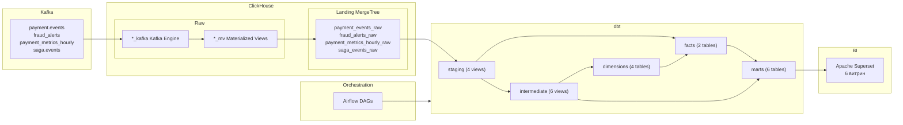
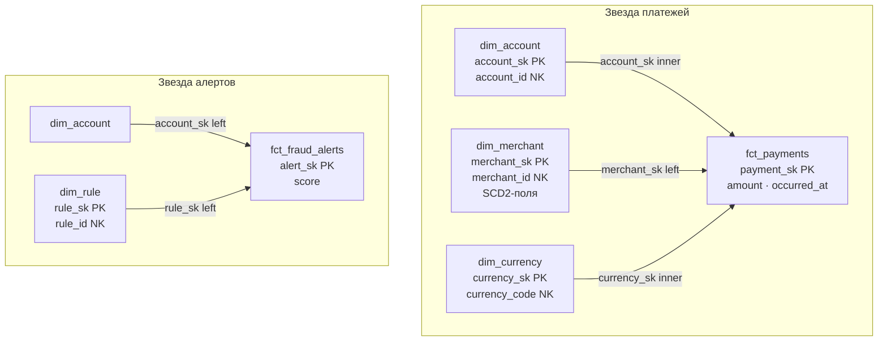
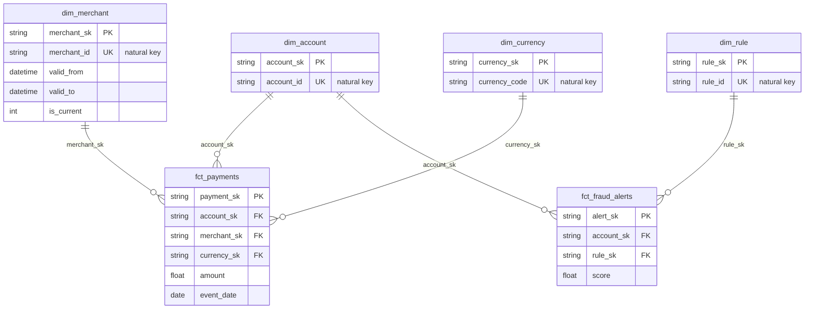
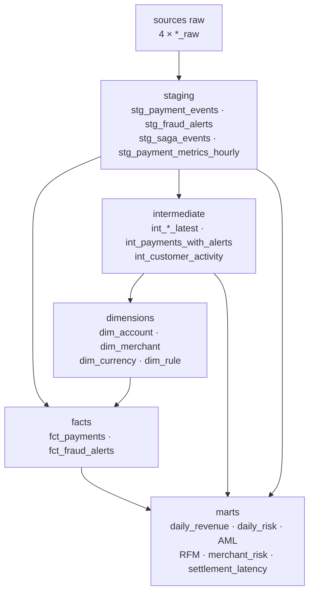

# PayPulse Analytics

**Схема:**



ELT-контур платёжной аналитики: `Kafka → ClickHouse (Kafka Engine + MV) → dbt (звезда) → Airflow → Superset`.

Закрывает задачу «от живого потока платежей до compliance-витрин»: выручка, AML structuring, RFM риска клиента, latency саги, профиль мерчанта, дневной fraud-отчёт. Live-операции остаются в React Ops ([ADR 0006](../docs/ADR/0006-analytics-split-superset-vs-react.md)).

**Ключевые возможности:**

- ✅ Real-time ingest в ClickHouse: Kafka Engine + Materialized Views + TTL
- ✅ Многослойное моделирование dbt: staging → intermediate → dimensions → facts → marts
- ✅ Star schema с surrogate keys (`dbt_utils`) и relationship-тестами
- ✅ 6 бизнес-витрин: revenue, risk, AML, RFM, merchant, settlement latency
- ✅ Airflow: слои по тегам + `dbt test` + freshness DQ
- ✅ Superset на ClickHouse (`clickhouse-connect`)
- ✅ Overlay `compose.analytics.yml` без смешивания с Flink/Grafana на слабом ноутбуке

---

## 🛠 Технологический стек

| Компонент | Технология | Описание |
|-----------|------------|----------|
| **События** | Kafka (core compose) | `payment.events`, `fraud_alerts`, `saga.events`, `payment_metrics_hourly` |
| **OLAP / DWH** | ClickHouse 23.x | БД `paypulse_analytics` |
| **Трансформации** | dbt-clickhouse + dbt_utils 1.1.1 | 22 модели, custom tests, SK |
| **Оркестрация** | Apache Airflow 2.8 | LocalExecutor, BashOperator, schema `airflow` в общем Postgres |
| **BI** | Apache Superset 3.1 | Витрины ClickHouse |
| **Инфраструктура** | `compose.analytics.yml` | Airflow web/scheduler + Superset |

Аналитические витрины живут **только в ClickHouse**. Postgres в overlay — метаданные Airflow (schema `airflow`), не DWH.

---

## 🔧 Требования

- Docker Compose v2
- Поднятый **core** стек (`docker compose up -d`) с Kafka + ClickHouse
- Для локального dbt: Python 3.11+, `pip install dbt-clickhouse`

---

## 🚀 Быстрый старт

```bash
# 1) Core (Kafka, ClickHouse, платежный контур)
docker compose up -d

# 2) Analytics overlay
docker compose -f docker-compose.yml -f compose.analytics.yml up -d

# 3) Локальный dbt (опционально)
cd analytics/dbt
cp profiles.yml.example profiles.yml
export CLICKHOUSE_HOST=localhost CLICKHOUSE_PORT=8124 CLICKHOUSE_USER=default CLICKHOUSE_PASSWORD=
dbt deps && dbt debug && dbt run && dbt test
```

**Что поднимется:** Airflow (`:18087`), Superset (`:18089`), ingest в ClickHouse из Kafka уже идёт с core. DAG `paypulse_dbt_dag` строит слои каждые 6 часов (`deps` → staging → intermediate → dimensions → facts → marts).

Остановка overlay: `docker compose -f docker-compose.yml -f compose.analytics.yml stop`.  
Полная очистка данных: `docker compose down -v`.

> На ограниченной RAM не поднимайте analytics вместе с Flink (`compose.stream.yml`) и observability.

---

## 🌐 URL сервисов

| Сервис | URL | Credentials | Описание |
|--------|-----|-------------|----------|
| **Airflow** | http://localhost:18087 | admin / admin | DAG dbt + DQ |
| **Superset** | http://localhost:18089/superset/dashboard/paypulse-analytics/ | admin / admin | дашборд по 6 marts |
| **ClickHouse HTTP** | http://localhost:8124 | default / (пусто) | raw + dbt-модели |
| **Kafka UI** | http://localhost:18088 | — | топики-источники |

---

## 📁 Структура

```
pay-pulse/
├── compose.analytics.yml
├── clickhouse/init/
│   ├── 001-kafka-and-raw.sql          # payment.events → payment_events_raw
│   └── 002-analytics-pipeline.sql     # fraud_alerts, metrics hourly, saga.events
├── analytics/
│   ├── README.md
│   ├── dbt/
│   │   ├── dbt_project.yml
│   │   ├── packages.yml                   # dbt_utils
│   │   ├── profiles.yml.example
│   │   ├── macros/                        # positive_amount, fraud_score_in_range
│   │   └── models/
│   │       ├── staging/                   # 4 × stg_*
│   │       ├── intermediate/              # 6 × int_*
│   │       ├── dimensions/                # dim_account, dim_merchant, dim_currency, dim_rule
│   │       ├── facts/                     # fct_payments, fct_fraud_alerts
│   │       └── marts/                     # 6 витрин
│   └── superset/
│       ├── Dockerfile
│       └── init/bootstrap.sh + provision_dashboard.py
├── airflow/
│   ├── Dockerfile                     # airflow + dbt-clickhouse + git
│   └── dags/
│       ├── paypulse_dbt_dag.py
│       ├── paypulse_dbt_test_dag.py
│       └── paypulse_data_quality_dag.py
```

---

## 🔄 Kafka Ingestion Pattern

```
Kafka topic ──► *_kafka (Kafka Engine) ──► *_mv (Materialized View) ──► *_raw (MergeTree + TTL)
```

| Topic | Landing | TTL |
|-------|---------|-----|
| `payment.events` | `payment_events_raw` | — |
| `fraud_alerts` | `fraud_alerts_raw` | 90d |
| `payment_metrics_hourly` | `payment_metrics_hourly_raw` | 180d |
| `saga.events` | `saga_events_raw` | 90d |

Poison messages `payment.events` уходят в `payment_events_dlq`. dbt читает только `*_raw` через source `raw` (schema `paypulse_analytics`).

---

## Star Schema

Основная звезда — **`fct_payments`**: одна строка на платёжное событие. Время в факте (`occurred_at`, `event_date`), отдельного `dim_date` нет.

Вторая звезда (conformed `dim_account`) — **`fct_fraud_alerts`**: одна строка на alert.





- **`fct_payments.account_sk` → `dim_account`** — обязательная.
- **`fct_payments.merchant_sk` → `dim_merchant`** — left; пустой merchant → `unknown`.
- **`fct_payments.currency_sk` → `dim_currency`** — обязательная.

*SK = `dbt_utils.generate_surrogate_key`, NK = natural key из события. `dim_merchant` несёт фиктивные `valid_from` / `valid_to` / `is_current` (как `dim_product` в ecommerce-batch-pipeline).*

---

## 🏗️ Слои dbt



### Staging

| Модель | Источник | Что делает |
|--------|----------|------------|
| `stg_payment_events` | `payment_events_raw` | `event_date`, merchant `unknown` |
| `stg_fraud_alerts` | `fraud_alerts_raw` | `rule_id` coalesce → `unknown` |
| `stg_saga_events` | `saga_events_raw` | lifecycle саги |
| `stg_payment_metrics_hourly` | `payment_metrics_hourly_raw` | hourly агрегаты Flink |

### Intermediate

| Модель | Что делает |
|--------|------------|
| `int_accounts_latest` | срез счёта: first/last seen, `payment_count` |
| `int_merchants_latest` | срез мерчанта для dim |
| `int_currencies` | distinct валют |
| `int_rules_latest` | срез fraud rule |
| `int_payments_with_alerts` | платёж ⟕ alert |
| `int_customer_activity` | recency / frequency / monetary + high-risk count |

### Dimensions

| Модель | Источник | Материализация |
|--------|----------|----------------|
| `dim_account` | `int_accounts_latest` | table + SK |
| `dim_merchant` | `int_merchants_latest` | table + SK + SCD2-поля |
| `dim_currency` | `int_currencies` | table + SK |
| `dim_rule` | `int_rules_latest` | table + SK |

### Facts

| Модель | Grain | Источники |
|--------|-------|-----------|
| `fct_payments` | 1 платёж | `stg_payment_events` + 3 dim join |
| `fct_fraud_alerts` | 1 alert | `stg_fraud_alerts` + account/rule |

### Marts

| Витрина | Источник | Метрики |
|---------|----------|---------|
| `mart_daily_revenue` | `fct_payments` | `payment_count`, `total_revenue`, `avg_payment_amount` |
| `mart_daily_risk_report` | `fct_fraud_alerts` | `alert_count`, `avg_fraud_score`, `affected_users` |
| `mart_aml_structuring_patterns` | `fct_payments` | дневная сумма ниже порога, ≥3 платежа |
| `mart_customer_risk_rfm` | `int_customer_activity` | recency / frequency / monetary → `LOW`/`MEDIUM`/`HIGH` |
| `mart_merchant_risk_profile` | `fct_payments` + alerts | объём, `alert_count`, avg/max score |
| `mart_settlement_latency` | `stg_saga_events` | секунды `SAGA_STARTED` → `SAGA_COMPLETED` |

Custom tests: `positive_amount`, `fraud_score_in_range`. На фактах — `relationships` к измерениям.

---

## 🔗 Оркестрация (Airflow)

```
paypulse_dbt_dag:        dbt deps → staging → intermediate → dimensions → facts → marts
paypulse_dbt_test_dag:   dbt test                          (каждые 6 ч :30)
paypulse_data_quality_dag: freshness payment_events_raw    (ежедневно 07:00)
```

| DAG | Расписание | Команды |
|-----|------------|---------|
| `paypulse_dbt_dag` | `0 */6 * * *` | `dbt deps`, `run --select tag:<layer>` |
| `paypulse_dbt_test_dag` | `30 */6 * * *` | `dbt test` |
| `paypulse_data_quality_dag` | `0 7 * * *` | freshness SQL в ClickHouse |

Код: [`airflow/dags/paypulse_dbt_dag.py`](../airflow/dags/paypulse_dbt_dag.py). `catchup=False`. Target/logs в `/tmp/dbt-*`. Образ ставит `git` для `dbt deps`; если есть `analytics/dbt/dbt_packages/dbt_utils`, deps пропускается. У `dbt-clickhouse` 1.8 нет `--target-path` — только `DBT_TARGET_PATH`. Freshness DAG: `throwIf` без вложенных кавычек (иначе `curl` падает).

---

## 📊 Superset

Bootstrap [`superset/init/bootstrap.sh`](superset/init/bootstrap.sh) создаёт admin, datasource **PayPulse ClickHouse** и дашборд **PayPulse Analytics** (6 чартов по витринам). Открыть: http://localhost:18089/superset/dashboard/paypulse-analytics/ (`admin`/`admin`).

Повторно накатить дашборд после `dbt run`: `docker exec paypulse-superset python /app/init/provision_dashboard.py`. Daily Revenue/Risk — bar (один день демо-данных; line с одной точкой выглядит пустым).

| Дашборд / чарт | Dataset | Тип | Что смотреть |
|----------------|---------|-----|----------------|
| Daily Risk | `mart_daily_risk_report` | Bar | `report_date` × `alert_count` |
| AML Structuring | `mart_aml_structuring_patterns` | Table | top `account_id` по `daily_total` |
| Customer RFM | `mart_customer_risk_rfm` | Bar | counts по `risk_segment` |
| Settlement Latency | `mart_settlement_latency` | Histogram | `latency_seconds` |
| Merchant Risk | `mart_merchant_risk_profile` | Bar | мерчанты × `alert_count` |
| Daily Revenue | `mart_daily_revenue` | Bar | `revenue_date` × `total_revenue` |

> На snap-docker publish порта иногда висит при healthy-контейнере. Обход: сеть Docker (`http://superset:8088`) или `docker exec`.

---

## 🧪 Полезные команды dbt

```bash
cd analytics/dbt
cp profiles.yml.example profiles.yml
export CLICKHOUSE_HOST=localhost CLICKHOUSE_PORT=8124

dbt deps
dbt run
dbt run --select tag:staging
dbt run --select tag:dimensions tag:facts
dbt run --select fct_payments+
dbt test
dbt test --select stg_payment_events
dbt compile --select dim_account
dbt ls --resource-type model
dbt docs generate && dbt docs serve
```

Скомпилированный SQL: `target/compiled/paypulse/models/<layer>/<model>.sql`.

---

## ✅ Чеклист

- [x] Kafka Engine + MV + MergeTree для 4 топиков
- [x] Star schema: 4 dimensions + 2 facts, surrogate keys
- [x] 6 бизнес-витрин (revenue / risk / AML / RFM / merchant / latency)
- [x] Custom tests + relationships на FK фактов
- [x] Airflow: послойный `dbt run` + `dbt test` + freshness
- [x] Superset: ClickHouse + дашборд **PayPulse Analytics**
- [x] Compose overlay отдельно от stream/observability
