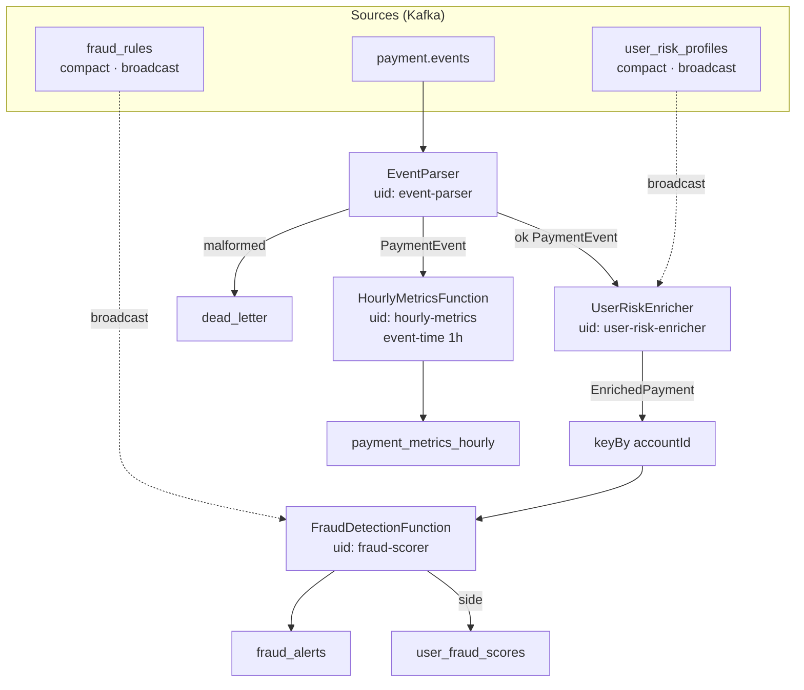

# ADR 0005 — Apache Flink vs Spark Structured Streaming for fraud detection

- Status: Accepted
- Date: 2026-06-18
- Context owner: flink-payment-intelligence / streaming team
- Related plan section: [`docs/pay-pulse-platform-plan.md`](../pay-pulse-platform-plan.md) §4 «Flink с broadcast rules», stage S4–S5
- Related ADRs: [0006](0006-analytics-split-superset-vs-react.md)

## Context

Real-time fraud / AML на PayPulse требует:

- **Sub-minute** (лучше seconds-level) latency на keyed state: velocity windows, geo anomaly.
- **Broadcast state** для динамических правил из compact topic `fraud_rules` без рестарта job.
- **Broadcast** baseline `user_risk_profiles`.
- Event-time окна для hourly metrics (`payment_metrics_hourly`).
- Side outputs: `fraud_alerts`, `user_fraud_scores`, `dead_letter`.

Spark Structured Streaming (micro-batch) умеет streaming joins и watermarking, но:

- broadcast / map-side rule refresh менее идиоматичен, чем Flink `BroadcastProcessFunction`;
- checkpoint / exactly-once семантика и low-latency keyed timers — сильнее сторона Flink;
- reference portfolio уже на Flink (`data-pipelines/clickstream-analytics-pipeline`).

Batch Spark / nightly jobs остаются в зоне dbt/Airflow на ClickHouse ([ADR 0006](0006-analytics-split-superset-vs-react.md)), не на path алертов.

## Decision

Используем **Apache Flink** (job module `flink-payment-intelligence`, Kotlin, **JVM 11** bytecode target) как единственный stream processor fraud path:

- Entry: `PaymentIntelligenceJob` — sources `payment.events`, `fraud_rules`, `user_risk_profiles`.
- `EventParser` + dead-letter side output (`DeadLetterTag`) вместо fail-job на bad JSON.
- `UserRiskEnricher` — broadcast connect profiles.
- Keyed by `accountId` → `FraudDetectionFunction` + broadcast rules; helpers `VelocityChecker`, `GeoAnomalyDetector`, AML `StructuringDetector`, `FraudScorer`.
- Sinks: `fraud_alerts`, compact `user_fraud_scores`, `payment_metrics_hourly`, `dead_letter` (`KafkaSinks` / env via `FlinkJobProperties`).
- Ops: checkpointing + Flink `PrometheusReporter` (порт `:9249`), dashboards в Grafana; chaos notes в `docs/chaos.md`.

**Spark Structured Streaming / Spark Streaming — out of scope for MVP.**

Job: `flink-payment-intelligence` · UI `:8081` · metrics `:9249`. Детали запуска: [`flink-payment-intelligence/README.md`](../../flink-payment-intelligence/README.md).

### Operator graph

### Detection logic (внутри FraudDetectionFunction)

| Checker | Idea |
|---------|------|
| `VelocityChecker` | N payments / window per account |
| `GeoAnomalyDetector` | sudden geo / risk tier mismatch |
| `StructuringDetector` | many sub-threshold amounts (AML) |
| `FraudScorer` | combines rule JSON + enrich scores |

Rules hot-reload: update `rule_management.fraud_rule` → outbox CDC → `fraud_rules` → broadcast state **без** job restart.

### Operators

| UID | Type | Input | Output |
|-----|------|-------|--------|
| `event-parser` | FlatMap + side output | raw JSON | `PaymentEvent` / DLT |
| `user-risk-enricher` | Broadcast connect | event + profile | `EnrichedPayment` |
| `fraud-scorer` | Keyed broadcast process | enriched + rule | alerts, scores |
| `hourly-metrics` | Event-time window 1h | `PaymentEvent` | hourly metrics |

### State & checkpoints

- Backend: `HashMapStateBackend`
- Storage: `FileSystemCheckpointStorage` (`/checkpoints`, volume shared JM/TM)
- После `docker kill` TaskManager job восстанавливается из checkpoint ([docs/chaos.md](../chaos.md) §4)
- Стабильные `uid` / `name` — обязательны; смена uid = потеря state

## Consequences

### Positive

- Native broadcast state: rule CRUD (`rule-management-service`) → CDC → Kafka → Flink без redeploy job.
- Keyed process + timers хорошо выражают velocity / session-like checks.
- Side outputs дают чистый контракт для BFF SSE (`fraud_alerts`) и DLT.
- Prometheus metrics на job уровне (records/sec, checkpoint, backpressure) стыкуются с S8.
- Согласовано с clickstream reference — меньше «двух streaming стеков» в портфолио.

### Negative / accepted limitations

- Отдельный **JVM 11** toolchain vs JDK 21 Spring-сервисов (Gradle multi-release / separate module).
- Flink cluster ops (JM/TM, checkpoints на volume) — отдельная поверхность отказа; см. chaos drills.
- Нет unified SQL UI «как Spark»; ad-hoc analytics — ClickHouse/Superset, не Flink SQL.
- Local resource: TaskManagers тяжёлее лёгкого Kafka Streams app (частично закрыто `kstreams-saga-events-agg` только для saga metrics).

## Alternatives considered

1. **Spark Structured Streaming** — rejected для fraud alerts: micro-batch latency + слабее broadcast-rules story для S5 demo.
2. **Kafka Streams only** — considered для простых aggregations; rejected как primary fraud engine (нет первоклассного broadcast state / Flink-parity с reference AML graph). Используется точечно: `kstreams-saga-events-agg`.
3. **Rules in participant-fraud-check only (sync Redis score)** — insufficient alone: нужен continuous scoring + alerts stream; participant читает last score, Flink его производит.
4. **Flink SQL / Table API only** — rejected: custom AML structuring и scoring удобнее DataStream + Kotlin functions.

## Code pointers

| Area | Path |
|------|------|
| Job entry / graph | `flink-payment-intelligence/src/main/kotlin/.../PaymentIntelligenceJob.kt` |
| Fraud core | `.../scoring/FraudDetectionFunction.kt`, `FraudScorer.kt` |
| Rules / AML helpers | `.../rules/VelocityChecker.kt`, `GeoAnomalyDetector.kt`, `.../aml/StructuringDetector.kt` |
| Enrichment | `.../enrich/UserRiskEnricher.kt` |
| Parse / DLT | `.../io/EventParser.kt`, `DeadLetterTag.kt` |
| Metrics window | `.../metrics/HourlyMetricsFunction.kt` |
| Config / topics | `.../config/FlinkJobProperties.kt` |
| Dynamic rules producer | `rule-management-service/`, Debezium `rule-management-outbox.json` |
| Module README | `flink-payment-intelligence/README.md` |

## See also / Revisit

- [ADR 0006](0006-analytics-split-superset-vs-react.md) — Flink → Kafka → ClickHouse; BI = Superset, не Flink UI.
- [ADR 0008](0008-no-distributed-tracing-mvp.md) — нет OTel traces через Flink operators в MVP.
- Stages: [`docs/stages/S4.md`](../stages/S4.md), [`S5.md`](../stages/S5.md); chaos: [`docs/chaos.md`](../chaos.md).

**Revisit triggers**

- Команда уже стандартизирована на Spark и не хочет второй runtime → переоценка (с потерей broadcast DX).
- Нужен unified batch+streaming lakehouse job на Spark 3.x / Structured Streaming для тяжёлых feature pipelines — Flink может остаться только для alerts.
- Flink SQL + catalogs закрывают 80% кастомных функций — возможен partial move.
