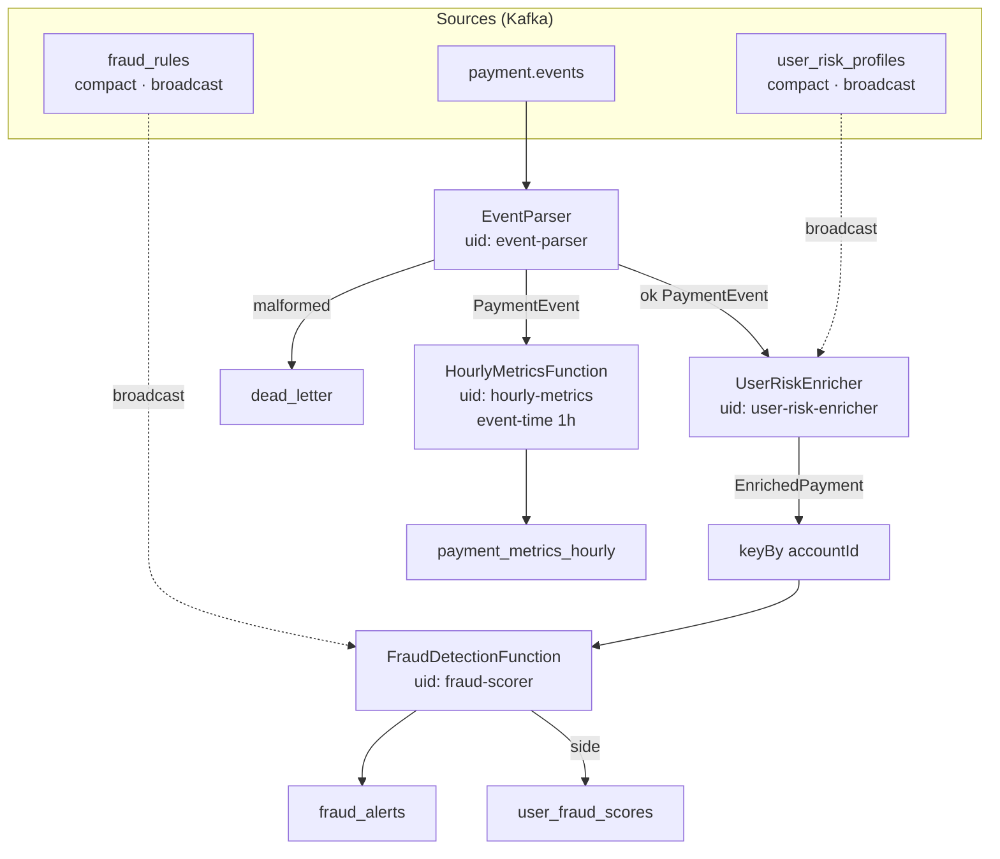

# Flink Payment Intelligence — operator graph

Вынесено из корневого README ([ADR 0005](../ADR/0005-flink-vs-spark-streaming.md)). Job: `flink-payment-intelligence` · UI `:8081` · metrics `:9249`.

## Graph

## Detection logic (внутри FraudDetectionFunction)

| Checker | Idea |
|---------|------|
| `VelocityChecker` | N payments / window per account |
| `GeoAnomalyDetector` | sudden geo / risk tier mismatch |
| `StructuringDetector` | many sub-threshold amounts (AML) |
| `FraudScorer` | combines rule JSON + enrich scores |

Rules hot-reload: update `rule_management.fraud_rule` → outbox CDC → `fraud_rules` → broadcast state **без** job restart.

## Operators

| UID | Type | Input | Output |
|-----|------|-------|--------|
| `event-parser` | FlatMap + side output | raw JSON | `PaymentEvent` / DLT |
| `user-risk-enricher` | Broadcast connect | event + profile | `EnrichedPayment` |
| `fraud-scorer` | Keyed broadcast process | enriched + rule | alerts, scores |
| `hourly-metrics` | Event-time window 1h | `PaymentEvent` | hourly metrics |

## State & checkpoints

- Backend: `HashMapStateBackend`
- Storage: `FileSystemCheckpointStorage` (`/checkpoints`, volume shared JM/TM)
- После `docker kill` TaskManager job восстанавливается из checkpoint ([docs/chaos.md](../chaos.md) §4)
- Стабильные `uid` / `name` — обязательны; смена uid = потеря state

## Build / run

См. [flink-payment-intelligence/README.md](../../flink-payment-intelligence/README.md).
