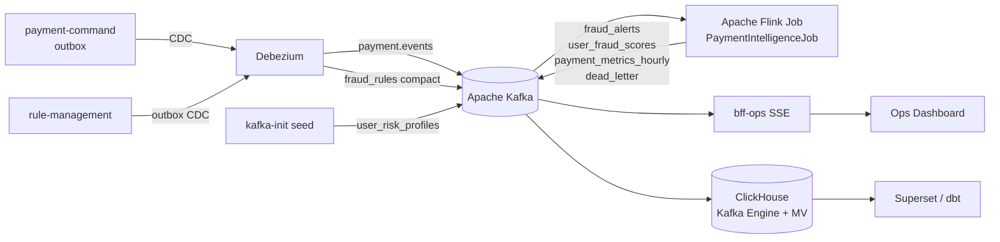
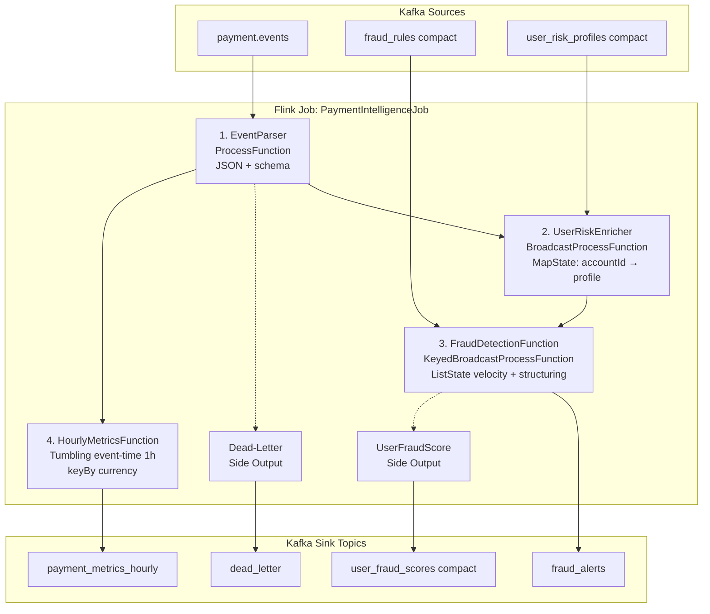
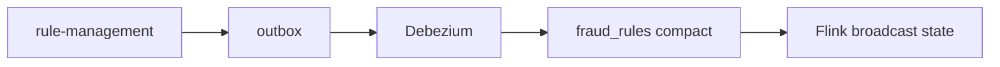
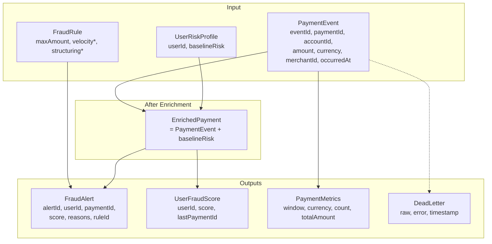

# ⚡ PayPulse Payment Intelligence (Apache Flink)

Стриминговый пайплайн на **Apache Flink** для real-time fraud / AML по платежам.
Акцент на **keyed state** (velocity + structuring окна), **broadcast state**
(два независимых стрима: `fraud_rules` и `user_risk_profiles`) и **side outputs**
(`dead_letter`, `user_fraud_scores`). Граф операторов виден на Flink Dashboard.

> ADR: [0005 Flink vs Spark](../docs/ADR/0005-flink-vs-spark-streaming.md) ·
> uid / restore: [docs/architecture/flink-graph.md](../docs/architecture/flink-graph.md)

---

## Схема



---

## Ключевые возможности

- ✅ **Parse + dead-letter**: `ProcessFunction` валидирует JSON; битые записи в side output, job не падает
- ✅ **User risk enrichment**: `BroadcastProcessFunction`, `MapState userId → profile`, дефолт baseline `0.1`
- ✅ **Keyed fraud scoring**: `KeyedBroadcastProcessFunction` по `accountId` + динамические правила
- ✅ **Velocity**: `ListState<Long>` timestamps, скользящее окно (`velocityWindowMs` / `velocityMaxCount`)
- ✅ **AML structuring (smurfing)**: много платежей `< threshold`, сумма `> threshold` за N часов
- ✅ **Geo stub**: `merchantId` содержит `:foreign` → сигнал `geo_anomaly` (демо; не geo-IP)
- ✅ **Weighted score** ∈ `[0, 1]`: amount / velocity / geo / structuring + baseline риска
- ✅ **Hourly metrics**: tumbling event-time 1h по валюте (`ProcessWindowFunction`)
- ✅ **Hot-reload правил**: compact `fraud_rules` → broadcast, без рестарта job
- ✅ **Checkpointing**: hashmap backend, 60s, externalized, retain on cancellation
- ✅ **At-least-once** в Kafka sinks; exactly-once только внутри Flink state
- ✅ **Стабильные `uid` / `name`**: restore после kill TaskManager ([chaos](../docs/chaos.md) §4)

---

## Граф операторов Flink



Watermark на платежах: `forBoundedOutOfOrderness(5s)` + `withIdleness(30s)`, timestamp = `occurredAtEpochMs`.

---

## 🛠 Технологический стек

| Компонент | Технология | Роль |
|-----------|------------|------|
| Stream processing | **Apache Flink 1.17.2** (Kotlin, DataStream API, JVM 11) | Keyed / broadcast state, event-time windows, side outputs |
| Message broker | **Apache Kafka** | Ingress + compact configs + egress |
| CDC правил | Debezium + `rule-management` outbox | Hot-reload `fraud_rules` |
| OLAP | ClickHouse Kafka Engine + MV | `fraud_alerts`, `payment_metrics_hourly` → dbt |
| Live ops | `bff-ops` SSE + React | `/alerts` с `fraud_alerts` |
| Метрики job | Flink PrometheusReporter `:9249` | Grafana overlay |
| Оркестрация | `compose.stream.yml` | JM + TM + `flink run` submit |
| Kafka UI | Redpanda Console | топики |

Сервисы платформы — **JDK 21**. Этот модуль отдельно таргетится на **JVM 11**: Flink 1.17 не принимает 21 bytecode.

---

## Архитектура обработки

### 1. `EventParser` (ProcessFunction)

Читает сырой JSON из `payment.events`, парсит в `PaymentEvent` (`PaymentJson`).
Обязательны `eventId`, `paymentId`, `accountId`, `amount`. Невалидный JSON /
отсутствие полей → side output `DEAD_LETTER_TAG` (`raw` обрезан до 2000 символов,
`error`, timestamp). Job продолжает работать.

### 2. `UserRiskEnricher` (BroadcastProcessFunction)

Broadcast `MapState<String, UserRiskProfile>` (`accountId` / `userId` → профиль).
Каждый платёж обогащается `baselineRisk`. Нет профиля → **0.1**.
Сид в `kafka-init`: `acc-1` / `acc-2`. Обновления профиля применяются без рестарта.

### 3. `FraudDetectionFunction` (KeyedBroadcastProcessFunction)

Key = `accountId`. Активное правило из broadcast (`RULE_KEY = "rule"`); если нет —
`FraudRule.DEFAULT`. Keyed state:

| State | Содержимое | Зачем |
|-------|------------|-------|
| `velocity-timestamps` | `ListState<Long>` | платежи в `velocityWindowMs` |
| `structuring-records` | `ListState<AmountAt>` | суммы за `structuringWindowHours` |

Сигналы → `FraudScorer` (веса: amount 0.35, velocity 0.30, geo 0.15, structuring 0.45, baseline × 0.20).
Score клипуется в `[0, 1]`.

- **Main output** — `FraudAlert`, только если есть `reasons` (порог пробит).
- **Side output** `USER_SCORE_TAG` — `UserFraudScore` на каждый платёж (compact sink).

Чистая логика (без Flink API) вынесена в helpers — их покрывает `FraudLogicTest`:

| Helper | Идея |
|--------|------|
| `VelocityChecker` | count в окне `> velocityMaxCount` |
| `StructuringDetector` | ≥ `structuringMinPayments` мелких, сумма `> structuringThreshold` |
| `GeoAnomalyDetector` | `merchantId` содержит `:foreign` |
| `FraudScorer` | взвешенная сумма сигналов + reasons |

### 4. `HourlyMetricsFunction` (ProcessWindowFunction)

`keyBy(currency)` + tumbling **1h event-time**. Эмитит `PaymentMetrics`
(`count`, `totalAmount`, границы окна). Downstream: ClickHouse / dbt
`stg_payment_metrics_hourly`.

---

## Broadcast State Pattern

**Задача:** низкочастотная конфигурация (правила, риск-профили) на всех параллельных
инстансах без рестарта и без shuffle платежей.

**Решение:** compact Kafka → `.broadcast(MapStateDescriptor)` → `connect` с event-стримом
→ `BroadcastProcessFunction` / `KeyedBroadcastProcessFunction`.

| Broadcast поток | Descriptor | Оператор | Применение |
|-----------------|------------|----------|------------|
| `fraud_rules` | `RULES_STATE: String → FraudRule` | `FraudDetectionFunction` | пороги amount / velocity / AML |
| `user_risk_profiles` | `PROFILE_STATE: String → UserRiskProfile` | `UserRiskEnricher` | baseline risk на платеже |

Правила в проде: CRUD `rule-management-service` → outbox → Debezium → `fraud_rules`.
Демо: [`docs/demo/rule-update.http`](../docs/demo/rule-update.http).



На старте `kafka-init` пушит snapshot:

```json
{"ruleId":"rule-default","version":1,"enabled":true,"maxAmount":10000,"velocityWindowMs":3600000,"velocityMaxCount":50,"structuringThreshold":9900,"structuringWindowHours":24,"structuringMinPayments":3}
```

---

## Модель данных



---

## Kafka Topics

| Топик | Producer | Consumer | Partitions | Cleanup | Назначение |
|-------|----------|----------|------------|---------|------------|
| `payment.events` | Debezium (payment outbox / ES) | Flink, projection, saga, BFF | 3 | delete | Канонический поток платежей |
| `fraud_rules` | Debezium rules outbox + seed | Flink (broadcast) | 3 | **compact** | Динамические пороги |
| `user_risk_profiles` | kafka-init seed | Flink (broadcast) | 3 | **compact** | Baseline риск |
| `fraud_alerts` | Flink (main) | BFF SSE, ClickHouse | 6 | delete | Алерты с `reasons` |
| `user_fraud_scores` | Flink (side output) | analytics | 3 | **compact** | Последний score по account |
| `payment_metrics_hourly` | Flink window | ClickHouse / dbt | 3 | delete | Оборот за час × валюта |
| `dead_letter` | Flink parser side output | ops | 3 | delete | Невалидный JSON |

Конфиг топиков и ключей: `FlinkJobProperties` (env `PAYPULSE_*`).

---

## 🔧 Требования

- Docker Compose v2
- JDK **11+** для сборки этого модуля (корневые Spring-сервисы — JDK 21)
- Сначала **core** стек (`docker compose up -d`): Kafka, Debezium, платежный контур
- ~2.5 ГБ RAM на JM (1g) + TM (1.5g) поверх core
- Shadow JAR до submit: `flink-payment-intelligence/build/libs/flink-payment-intelligence-all.jar`

---

## 🚀 Быстрый старт

```bash
# 1) Fat JAR (Flink 1.17 / JVM 11)
./gradlew :flink-payment-intelligence:shadowJar

# 2) Core + stream overlay (JM, TM, flink-submit)
docker compose -f docker-compose.yml -f compose.stream.yml up -d

# 3) Опционально метрики
docker compose -f docker-compose.yml -f compose.stream.yml -f compose.observability.yml up -d
```

Порядок: Kafka healthy → `kafka-init` (топики + seed rules/profiles) → JM/TM
(`chown flink` на `/checkpoints`) → `flink-submit` (`flink run -d -c PaymentIntelligenceJob`).

Генерация нагрузки / fraud burst: [`docs/demo/fraud-burst.http`](../docs/demo/fraud-burst.http)
(`velocity`, `structuring`, `geo-anomaly`).

Остановка overlay: `docker compose -f docker-compose.yml -f compose.stream.yml stop`.  
Полная очистка checkpoints: `docker compose down -v`.

> На ноутбуке не поднимайте stream вместе с analytics + observability, если мало RAM.

---

## 🌐 URL сервисов

| Сервис | URL | Credentials | Описание |
|--------|-----|-------------|----------|
| **Flink Dashboard** | http://localhost:8081 | — | Граф job, checkpoints, backpressure |
| **Flink Prometheus** | http://localhost:9249 | — | JM metrics endpoint |
| **Kafka UI** | http://localhost:18088 | — | топики alerts / rules / DLT |
| **Ops `/alerts`** | http://localhost:3000/alerts | admin / admin | SSE `fraud_alerts` |
| **Grafana** | http://localhost:3001 | admin / admin | dashboard Flink job (observability overlay) |

---

## Структура проекта

```
flink-payment-intelligence/
├── README.md
├── build.gradle.kts                    # Flink 1.17.2, shadowJar, JVM 11
└── src/
    ├── main/kotlin/com/paypulse/flink/
    │   ├── PaymentIntelligenceJob.kt   # wiring графа + Kafka I/O + checkpoints
    │   ├── config/FlinkJobProperties.kt
    │   ├── io/
    │   │   ├── EventParser.kt
    │   │   ├── PaymentJson.kt
    │   │   └── DeadLetterTag.kt
    │   ├── enrich/UserRiskEnricher.kt
    │   ├── scoring/
    │   │   ├── FraudDetectionFunction.kt
    │   │   └── FraudScorer.kt
    │   ├── rules/
    │   │   ├── VelocityChecker.kt
    │   │   └── GeoAnomalyDetector.kt
    │   ├── aml/StructuringDetector.kt
    │   ├── metrics/HourlyMetricsFunction.kt
    │   ├── model/Models.kt
    │   └── sink/KafkaSinks.kt          # AT_LEAST_ONCE JSON
    └── test/kotlin/com/paypulse/flink/
        ├── FraudLogicTest.kt           # scorers без кластера
        └── PaymentIntelligenceJobTest.kt  # MiniCluster, bounded fromElements
```

Overlay кластера: [`compose.stream.yml`](../compose.stream.yml).  
ClickHouse ingest алертов/метрик: `clickhouse/init/002-analytics-pipeline.sql`.

---

## Event model

Платёж в `payment.events` (после CDC). Минимальный JSON для парсера:

```json
{
  "eventId": "evt-1",
  "paymentId": "pay-1",
  "accountId": "acc-1",
  "amount": 9100.0,
  "currency": "USD",
  "merchantId": "acme",
  "occurredAt": "2026-06-18T12:00:00Z"
}
```

`occurredAt` — ISO-8601 (`OffsetDateTime` или `Instant`). Structuring-демо: несколько
платежей ~9000 за минуту на один `accountId`. Geo-демо: `merchantId` вида `shop:foreign`.

---

## Сборка и тесты

```bash
./gradlew :flink-payment-intelligence:shadowJar
# → flink-payment-intelligence/build/libs/flink-payment-intelligence-all.jar

./gradlew :flink-payment-intelligence:test
# FraudLogicTest + MiniCluster PaymentIntelligenceJobTest (structuring burst)
```

Submit вручную (если overlay уже поднят):

```bash
docker compose -f docker-compose.yml -f compose.stream.yml up -d flink-submit
```

Env (defaults в скобках): `PAYPULSE_KAFKA_BOOTSTRAP` (`kafka:9092`),
`PAYPULSE_FLINK_CHECKPOINT_DIR` (`file:///checkpoints/paypulse-flink`),
имена топиков `PAYPULSE_*_TOPIC`.

---

## ✅ Что реализовано

- [x] E2E: payment CDC → Kafka → Flink → alerts / scores / hourly / DLT
- [x] `ProcessFunction` + dead-letter side output
- [x] `BroadcastProcessFunction` для user risk profiles
- [x] `KeyedBroadcastProcessFunction` для fraud / AML
- [x] Keyed `ListState` для velocity и structuring окон
- [x] Tumbling event-time 1h + `WatermarkStrategy.forBoundedOutOfOrderness` + idleness
- [x] Checkpointing (hashmap, 60s, RETAIN_ON_CANCELLATION, shared volume)
- [x] Стабильные `uid` / `name` на sources, operators, sinks
- [x] Hot-reload правил через compact topic
- [x] MiniCluster-тест графа + unit-тесты scorers
- [x] Overlay `compose.stream.yml` отдельно от analytics
