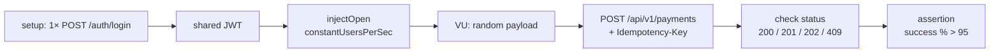

# load-test

Gatling-нагрузка на **write-path** PayPulse: burst создания платежей через `auth-gateway`.

Симуляция на **Java 21** (`src/gatling/java`), Gatling **Java DSL** 3.13 — без Scala.
Модуль в корневом Gradle (`io.gatling.gradle`).

В репозитории **одна** симуляция: `paypulse.PaymentBurstSimulation`. Это не набор
unit-тестов и не fraud-сценарии генератора (`/api/generator/scenarios/*`) — только
открытая модель «N пользователей в секунду × M минут → по одному `POST /payments`».



---

## Что гоняем

| Имя | Класс | Тип | Цель |
|-----|-------|-----|------|
| **PaymentBurst** | `PaymentBurstSimulation` | Gatling open-model | Устойчивость `POST /api/v1/payments` под постоянным RPS |

Каждый виртуальный пользователь (VU) делает **ровно один** HTTP-запрос и завершается.
`constantUsersPerSec(RPS)` ≈ целевой RPS **создания платежей**, пока latency не раздувает
очередь in-flight.

JWT берётся **один раз** до `setUp` (`java.net.http` → `POST /auth/login`). Логин
не входит в измеряемый RPS: иначе auth-gateway и Redis blacklist стали бы узким местом
сами по себе.

### Сценарий `PaymentBurst` (шаги)

1. **Login (setup, не VU)**  
   `POST {gateway}/auth/login` с `PAYPULSE_LOAD_USER` / `PAYPULSE_LOAD_PASSWORD`.  
   Ожидание: HTTP 200 и JSON-поле `accessToken`. Иначе симуляция **не стартует**
   (`IllegalStateException`).

2. **Session VU** — случайный payload:
   - `accountId` = `acc-load-{0..99999}` — размазать нагрузку по агрегатам, снизить
     optimistic lock на одном счёте;
   - `amount` = `10.00 … 499.99` USD — ниже дефолтного `maxAmount` (10 000), чтобы
     burst не был AML/amount-алертом;
   - `merchantId` = `load-merchant` (без `:foreign` → geo-stub Flink молчит);
   - `Idempotency-Key` = новый UUID на каждый VU — повтор ключа почти невозможен.

3. **Запрос**  
   `POST /api/v1/payments` через gateway (:8090) → `payment-command-service`:
   - headers: `Authorization: Bearer …`, `Content-Type: application/json`, `Idempotency-Key`;
   - body: `accountId`, `amount`, `currency: USD`, `merchantId`.

4. **Check (per request)** — статус из `{200, 201, 202, 409}` → OK, иначе KO.

5. **Assertion (вся симуляция)** — `global().successfulRequests().percent().gt(95)`  
   Gradle `:load-test:gatlingRun` падает, если доля OK ≤ 95%.

---

## Что проверяем / что считаем успехом

Gatling смотрит **только HTTP create** на краю. Сага, Flink, баланс — не ассертятся.

| Проверка | Как | Pass | Fail (KO / abort) |
|----------|-----|------|-------------------|
| Auth перед нагрузкой | setup login | 200 + `accessToken` | 4xx/5xx, нет токена → симуляция не идёт |
| Create принят | `status().in(200, 201, 202, 409)` | платёж создан или идемпотентный/конфликтный 409 | 400, 401, 403, 5xx, timeout, connect error |
| Доля успеха | `successfulRequests > 95%` | write-path держит целевой RPS | слишком много KO → ненулевой exit code |
| Идемпотентный контракт | уникальный `Idempotency-Key` на VU | штатный create (обычно 200) | коллизия ключа → 409, **всё равно OK** |
| JWT не штормит | один токен на всю симуляцию | RPS = платежи, не логины | истечение TTL токена → массовые 401 = KO |

**Почему 409 в OK:** controller отдаёт `409 CONFLICT` и на reuse `Idempotency-Key` с другим body,
и на optimistic concurrency (`aggregate_id, version`). Burst не должен валиться из‑за редких
lock-конфликтов на одном `accountId`. 409 **не** отделяет «дубль ключа» от «проигранный version».

**Что попадает в KO (ломает 95%):**

- `401` / `403` — токен истёк или gateway не пускает;
- `400` — валидация body (в этом сценарии payload валидный);
- `5xx` / обрыв соединения — gateway, command, Postgres;
- request timeout Gatling.

Целевой RPS плана — **1000 × 5 мин** (CI). На ноутбуке — 50–100. Симуляция **не** проверяет,
что фактический RPS равен `GATLING_TARGET_RPS`: смотри графики в HTML-отчёте
(если latency растёт, in-flight копится, достигнутый RPS падает).

---

## Что не проверяем

Это **не** покрывается `PaymentBurstSimulation` (другие инструменты):

| Не проверяем | Где смотреть |
|--------------|--------------|
| Сага `COMPLETED`, 4 шага | Ops UI / `docs/demo/payment-happy-path.http` |
| Fraud alerts, velocity, structuring | `payment-generator` + [`docs/demo/fraud-burst.http`](../docs/demo/fraud-burst.http) |
| Hot-reload правил Flink | [`docs/demo/rule-update.http`](../docs/demo/rule-update.http) |
| Auth RPS / refresh / logout | [`docs/demo/auth.http`](../docs/demo/auth.http) |
| Kill Kafka / Flink TM / CH | [`docs/chaos.md`](../docs/chaos.md) |
| p95 latency SLA | HTML-отчёт есть, **жёсткого assertion по latency нет** |
| Баланс / temporal query | account-query, не этот модуль |

Косвенно под нагрузкой работают outbox, Debezium, saga, Flink — но **pass/fail только HTTP**.
Имеет смысл параллельно смотреть Grafana (`paypulse_payments_total`, outbox lag) и Kafka lag.

---

## Стек

| Компонент | Технология |
|-----------|------------|
| Симуляция | `paypulse.PaymentBurstSimulation` |
| DSL | Gatling Java API 3.13.5 |
| Сборка | Gradle `io.gatling.gradle`, toolchain Java 21 |
| Обёртка | `load-test/run.sh` |

## Структура

```
load-test/
├── README.md
├── build.gradle.kts
├── run.sh
├── src/gatling/java/paypulse/
│   └── PaymentBurstSimulation.java
└── reports/                         # gitignore; HTML после прогона
```

## Quick start

Нужен поднятый core-стек (`auth-gateway` :8090, `payment-command`, Postgres).

```bash
chmod +x load-test/run.sh
./load-test/run.sh
```

Локальный HTML: `load-test/reports/<timestamp>/index.html`.

```bash
# laptop
GATLING_TARGET_RPS=100 GATLING_DURATION_MINUTES=5 ./load-test/run.sh

# план / CI
GATLING_TARGET_RPS=1000 GATLING_DURATION_MINUTES=5 ./load-test/run.sh
```

## Environment

| Variable | Default | Description |
|----------|---------|-------------|
| `PAYPULSE_GATEWAY_URL` | `http://localhost:8090` | Auth gateway |
| `PAYPULSE_LOAD_USER` | `admin` | Login |
| `PAYPULSE_LOAD_PASSWORD` | `admin` | Password |
| `GATLING_TARGET_RPS` | `100` | VU, стартующих в секунду |
| `GATLING_DURATION_MINUTES` | `5` | Длительность injection |

Объём запросов ≈ `RPS × durationMinutes × 60` (минус хвост in-flight).

## Hardware

| Target RPS | Ресурсы (gateway + зависимости) |
|------------|----------------------------------|
| 100 | 4 vCPU, 8 GB RAM (laptop / dev) |
| 500 | 8 vCPU, 16 GB RAM |
| 1000 | 16+ vCPU, 32 GB RAM |

JVM в `build.gradle.kts`: `-Xmx2G` и `--add-opens` (Gatling + JDK 21).

## Gradle

```bash
./gradlew :load-test:gatlingRun -Dgatling.simulationClass=paypulse.PaymentBurstSimulation
```

## Результаты

После прогона: `load-test/reports/<timestamp>/index.html` — OK/KO, latency percentiles,
достигнутый RPS. Assertion >95% success отражается в статусе Gradle.

Опубликованный отчёт: _(ссылка)_
