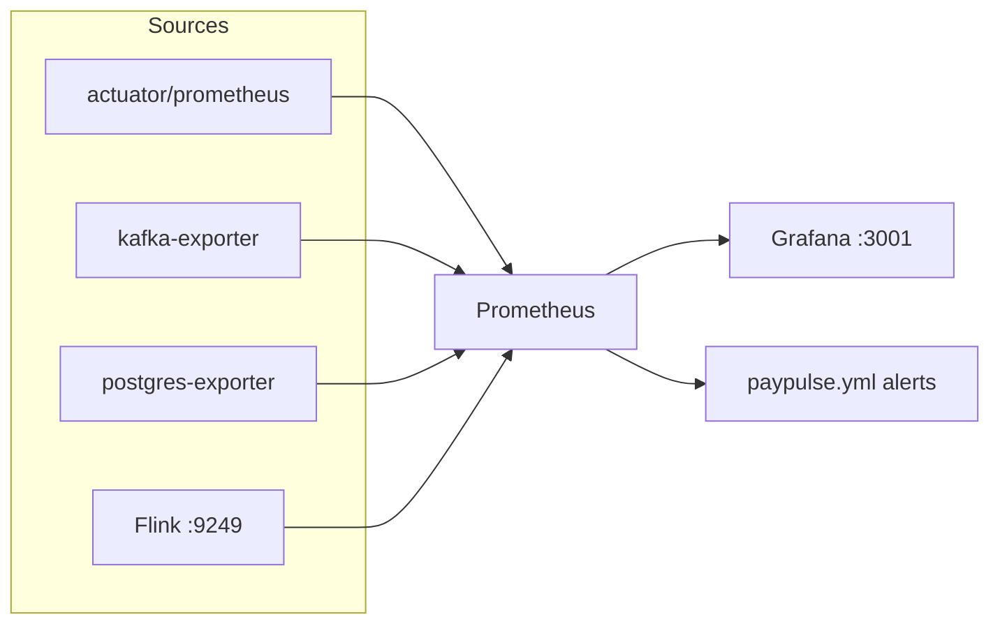

# PayPulse Observability

Prometheus + Grafana + exporters.

> [ADR 0008](../docs/ADR/0008-no-distributed-tracing-mvp.md) — **metrics first**, без Tempo/Jaeger в MVP.



## Quick start

```bash
docker compose -f docker-compose.yml -f compose.observability.yml up -d
```

Overlays:

```bash
# + Flink :9249
docker compose -f docker-compose.yml -f compose.stream.yml -f compose.observability.yml up -d

docker compose -f docker-compose.yml -f compose.analytics.yml up -d

docker compose -f docker-compose.yml -f compose.observability.yml --profile cadvisor up -d
```

## URLs

| Component | URL | Credentials |
|-----------|-----|-------------|
| Prometheus | http://localhost:9090 | — |
| Grafana | http://localhost:3001 | admin / admin |
| Kafka exporter | http://localhost:9308/metrics | — |
| Postgres exporter | http://localhost:9187/metrics | — |
| Ops `/health` | http://localhost:3000/health | ops login |


## Business metrics (`paypulse_*`)

| Metric | Type | Owner |
|--------|------|-------|
| `paypulse_payments_total` | Counter(`result`) | payment-command |
| `paypulse_saga_duration_seconds` | Timer | saga-engine |
| `paypulse_fraud_alerts_total` | Counter | bff-ops |
| `paypulse_outbox_lag_seconds` | Gauge | payment-command |
| `paypulse_idempotency_hits_total` | Counter | payment-command |
| `paypulse_optimistic_lock_conflicts_total` | Counter | payment-command |
| `paypulse_balance_projection_lag_seconds` | Gauge | projection-balance |
| `paypulse_dlt_messages_total` | Counter(`topic`) | projection-balance |
| `paypulse_auth_logins_total` | Counter(`result`) | auth-gateway |
| `paypulse_refresh_rotations_total` | Counter(`result`) | auth-gateway |

Common tags from `shared/metrics-starter`: `service`, `env`, `version`.

## Alert rules

`prometheus/rules/paypulse.yml`:

| Alert | Idea |
|-------|------|
| `HighFraudRate` | elevated fraud alert rate |
| `SagaCompensationBurst` | compensated saga rate |
| `KafkaConsumerLag` | exporter lag |
| `FlinkCheckpointFailure` | failed checkpoints |
| `OutboxLagHigh` | outbox lag > 30s |

```bash
docker run --rm -v "$PWD/prometheus/rules:/rules" prom/prometheus:v2.51.2 \
  promtool check rules /rules/paypulse.yml
```

## Grafana dashboards (folder **PayPulse**)

| JSON | Focus |
|------|-------|
| `paypulse-business-overview.json` | TPS, fraud, saga p95 |
| `paypulse-jvm-http.json` | JVM / HTTP |
| `paypulse-kafka-health.json` | lag / broker |
| `paypulse-flink-job.json` | checkpoints / throughput |
| `paypulse-pg-ch.json` | PG (+ CH when available) |
| `paypulse-saga-state.json` | saga outcomes |

## Self-check

```bash
curl -s http://localhost:9090/api/v1/targets | jq '.data.activeTargets[] | {job:.labels.job, health}'
curl -s http://localhost:9090/api/v1/rules | jq '.data.groups[].rules[].name'
curl -s http://localhost:8090/actuator/prometheus | grep paypulse_
```
