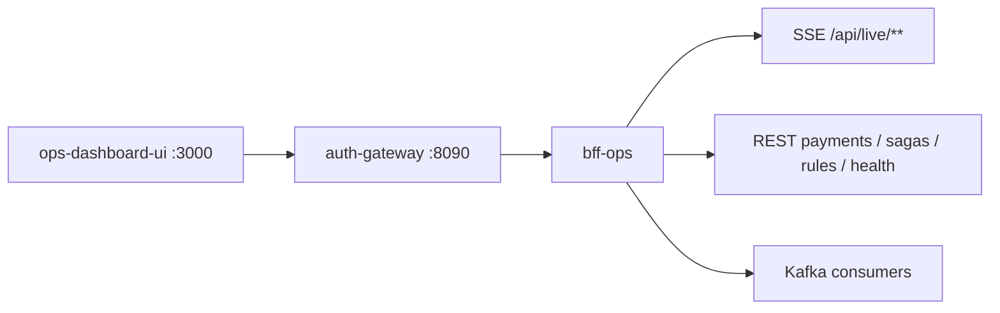

# ops-dashboard-ui

React **Operations Dashboard**: live-платежи, fraud alerts, динамические правила, stuck sagas, health платформы.

> ADR: [0006 ops vs BI](../docs/ADR/0006-analytics-split-superset-vs-react.md) · [0007 JWT / SSE token](../docs/ADR/0007-jwt-hs256-and-redis-blacklist.md)

## Стек

React 18 · Vite · TypeScript · Tailwind · TanStack Query · React Hook Form + zod · Recharts · custom `useSSE`.

## Требования

- Node.js **20+**
- Запущенные `auth-gateway` (:8090) и `bff-ops`

## Поток данных



Браузерный `EventSource` не шлёт `Authorization` → BFF принимает `?token=` на `/api/live/**` (`SseTokenWebFilter`).

## Dev

```bash
cd ops-dashboard-ui
npm install
npm run dev
# proxy → localhost:8090 (vite.config.ts)
```

## Docker

В compose UI отдаётся через **`ops-ui-server`** (WebFlux/Netty SPA + reverse proxy) — на snap-docker host-publish nginx/alpine часто зависает.

```bash
docker compose up -d ops-dashboard-ui
# http://localhost:3000  admin/admin
```

## Страницы

| Route | Данные | Заметки |
|-------|--------|---------|
| `/login` | JWT | refresh rotation |
| `/live` | SSE payments/sagas | EventSource |
| `/payments/:id` | aggregator + timeline | StepTimeline |
| `/alerts` | SSE fraud_alerts | filters + charts |
| `/rules` | REST + SSE ack | hot-reload Flink |
| `/sagas/stuck` | poll + admin actions | retry / force-complete |
| `/health` | `GET /api/health/summary` | probes |

## Тесты

```bash
npm test
# LoginPage, RulesPage, useSSE, alertsFilter
```

## Связанные сервисы

- `bff-ops` — SSE + aggregators
- `ops-ui-server` — production static + proxy
- Demo: [`docs/demo/`](../docs/demo/)
