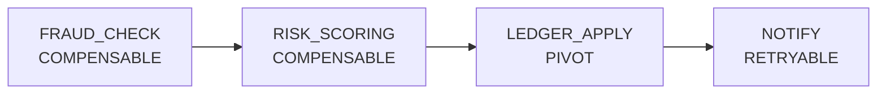
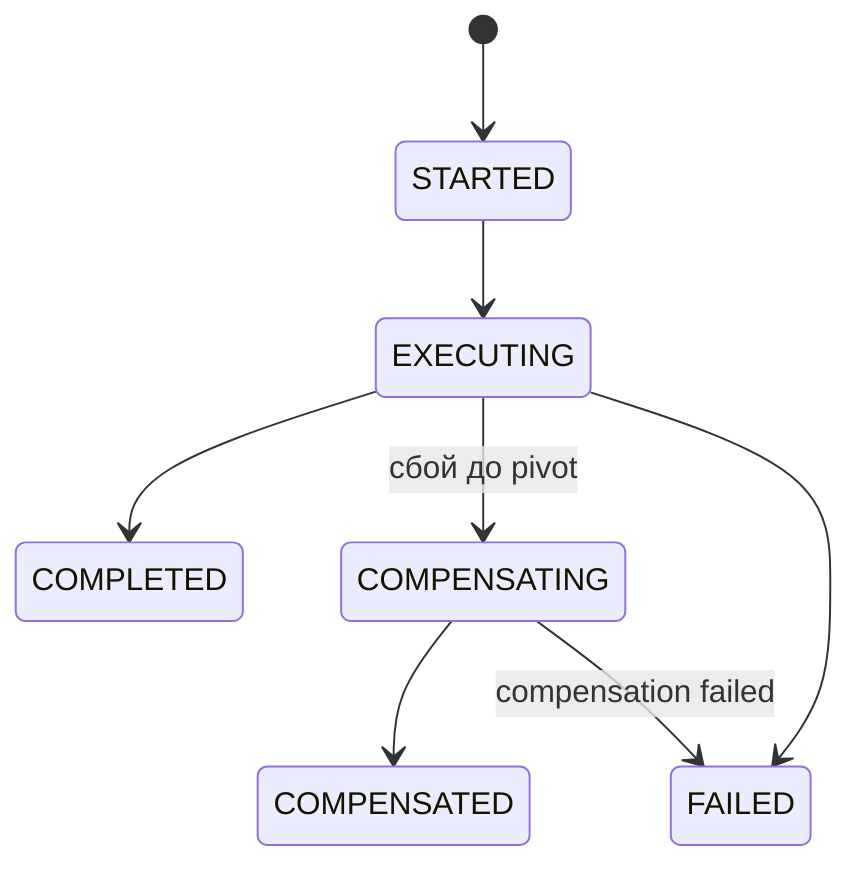
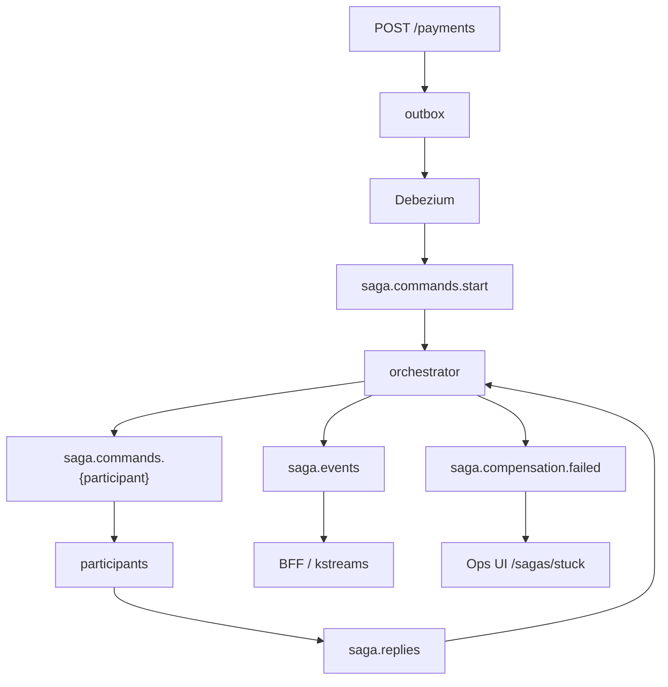

# payment-saga-orchestrator

Оркестратор **PaymentSaga**: проводит платёж через fraud → risk → ledger → notify, хранит состояние в Postgres и умеет компенсировать шаги до точки невозврата.

> ADR: [0002 Orchestrated saga vs choreography](../docs/ADR/0002-saga-orchestration-vs-choreography.md) · Этап: [S2](../docs/stages/S2.md) · Движок: `shared/saga-orchestrator-engine`

Модуль тонкий: регистрирует Kotlin DSL-определение саги. State machine, Kafka command/reply, timeout scheduler, admin REST и метрики живут в engine.

## Зачем

Платёж нельзя закрыть одной локальной транзакцией: антифрод, скоринг, ledger и уведомление — разные сервисы. Хореография размазывает статус по топикам, и оператор не видит, где сага зависла.

Оркестратор — единый source of truth: порядок шагов, retry, compensation, stuck-list и force-complete.

## PaymentSaga (SEC)

| Шаг | Тип | Участник | Если упал |
|-----|-----|----------|-----------|
| `FRAUD_CHECK` | Compensable | `participant-fraud-check` | компенсация + стоп |
| `RISK_SCORING` | Compensable | `participant-risk-scoring` | компенсация предыдущих Compensable |
| `LEDGER_APPLY` | **Pivot** | `participant-ledger-apply` | retry (точка невозврата) |
| `NOTIFY` | Retryable | `participant-notification` | retry, без компенсации ledger |

До pivot ошибка откатывает уже выполненные Compensable в обратном порядке. После успешного `LEDGER_APPLY` деньги проведены: дальше только retry `NOTIFY`, не «отмена» ledger.







## Kotlin DSL

Определение: [`PaymentSagaConfiguration.kt`](src/main/kotlin/com/paypulse/saga/definition/PaymentSagaConfiguration.kt).

```kotlin
saga<PaymentSagaData>("PaymentSaga") {
  step("FRAUD_CHECK") {
    type = StepType.COMPENSABLE
    participant = "fraud-check"
    command { data -> mapOf("paymentId" to data.paymentId, /* … */) }
    onReply { data, reply -> data.copy(fraudScore = reply.get("score")?.asDouble()) }
    compensation { data -> mapOf("paymentId" to data.paymentId) }
    timeout = Duration.ofSeconds(10)
  }
  step("RISK_SCORING") { type = StepType.COMPENSABLE; participant = "risk-scoring" }
  step("LEDGER_APPLY") { type = StepType.PIVOT; participant = "ledger-apply"; maxRetries = 5 }
  step("NOTIFY") { type = StepType.RETRYABLE; participant = "notification"; maxRetries = 3 }
}
```

Старт саги: `payment-command` пишет в outbox → Debezium → `saga.commands.start`. Прямой триггер: `POST /api/v1/sagas/PaymentSaga`.

## Kafka

| Топик | Кто пишет | Кто читает |
|-------|-----------|------------|
| `saga.commands.start` | Debezium (outbox платежа) | оркестратор |
| `saga.commands.fraud-check` | оркестратор | `participant-fraud-check` |
| `saga.commands.risk-scoring` | оркестратор | `participant-risk-scoring` |
| `saga.commands.ledger-apply` | оркестратор | `participant-ledger-apply` |
| `saga.commands.notification` | оркестратор | `participant-notification` |
| `saga.replies` | participants | оркестратор |
| `saga.events` | оркестратор | BFF SSE, kstreams |
| `saga.compensation.failed` | оркестратор | Ops UI `/sagas/stuck` |

Timeout: scheduler каждые 10 с помечает шаг старше 30 с как `FAILURE` и гоняет state machine (retry / compensate).

## REST (порт `:8083`)

Снаружи обычно через **auth-gateway** `:8090` и BFF.

| Method | Path | Назначение |
|--------|------|------------|
| POST | `/api/v1/sagas/{sagaType}` | старт саги вручную |
| GET | `/api/v1/sagas` | список (`status`, `sagaType`, paging) |
| GET | `/api/v1/sagas/{id}` | инстанс + шаги |
| GET | `/api/v1/sagas/{id}/steps` | шаги |
| GET | `/api/v1/sagas/stats` | counts по статусам |
| GET | `/api/v1/sagas/stuck` | застрявшие / compensation failure |
| POST | `/api/v1/sagas/{id}/retry` | redrive |
| POST | `/api/v1/sagas/{id}/force-complete` | admin complete |
| POST | `/api/v1/sagas/{id}/mark-resolved` | закрыть инцидент |
| GET | `/api/v1/sagas/stream` | SSE lifecycle |

Состояние в schema **`saga`**: `saga_instance`, `saga_step`, `compensation_failure` (Liquibase `006`, `008`).

## Запуск

```bash
docker compose up -d payment-saga-orchestrator \
  participant-fraud-check participant-risk-scoring \
  participant-ledger-apply participant-notification
```

Happy path: [`docs/demo/payment-happy-path.http`](../docs/demo/payment-happy-path.http). Actuator: `http://localhost:8083/actuator/health`.

## Тесты

```bash
./gradlew :payment-saga-orchestrator:test
```

| Тест | Что проверяет |
|------|----------------|
| `PaymentSagaDefinitionTest` | порядок шагов и типы SEC |
| `SagaStateMachineCompensationTest` | compensate до pivot, retry после |
| `PaymentSagaE2EIT` | Testcontainers: happy path → `COMPLETED` |
| `PaymentSagaCompensationIT` | сбой до pivot → `COMPENSATED` |

## Env

| Переменная | Default |
|------------|---------|
| `PAYPULSE_DB_HOST` / `PORT` / `NAME` | `localhost` / `55432` / `paypulse` |
| `PAYPULSE_KAFKA_BOOTSTRAP` | `localhost:19092` |
| `SERVER_PORT` | `8083` |

В compose Postgres `:5432`, Kafka `kafka:9092`.

## Связанные модули

- `shared/saga-model` — command/reply, `StepType`, `SagaStatus`
- `shared/saga-orchestrator-engine` — DSL, state machine, Kafka, REST
- `shared/saga-participant-starter` — consumer + handler у участников
- `participant-*` — четыре шага
- `ops-dashboard-ui` `/sagas/stuck`, `bff-ops` aggregator
- Grafana «Saga State», `kstreams-saga-events-agg`
